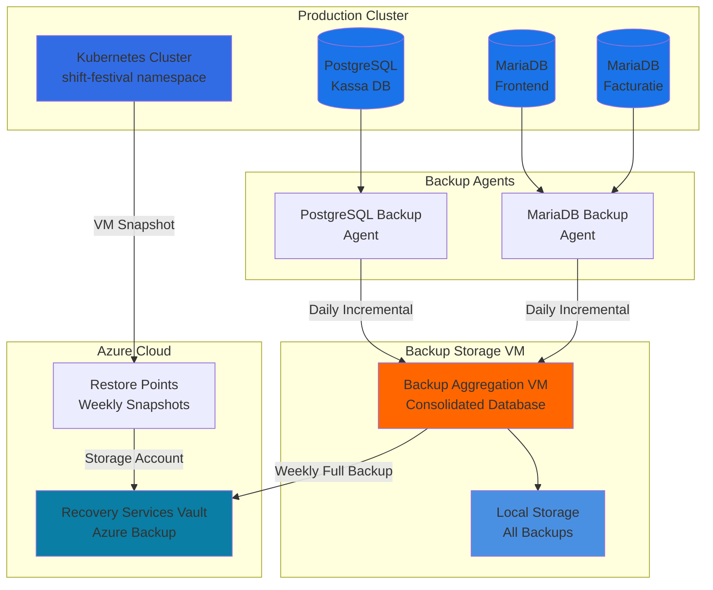

# ShiftFestival Infrastructure Backup Strategy

## Overview

This document outlines comprehensive backup and disaster recovery procedures for the ShiftFestival infrastructure. We implement a multi-layered backup approach combining:

- **Azure VM Backup** - OS and infrastructure backups
- **Database Backups** - Incremental and full backups of PostgreSQL and MariaDB
- **Centralized Backup Storage** - Remote backup aggregation VM
- **Automated Scheduling** - Weekly and daily backup automation

---

## Table of Contents

- [Backup Architecture](#backup-architecture)
- [Database Backup Strategy](#database-backup-strategy)
  - [PostgreSQL Backups](#postgresql-backups)
  - [MariaDB Backups](#mariadb-backups)
- [Azure VM Backup](#azure-vm-backup)
  - [Restore Point Creation](#restore-point-creation)
  - [Automated Scheduling](#automated-scheduling)
- [Backup Aggregation](#backup-aggregation)
- [Recovery Procedures](#recovery-procedures)
- [Monitoring & Alerts](#monitoring--alerts)

---

## Backup Architecture



### Backup Schedule

| Type | Frequency | Retention | Location |
|------|-----------|-----------|----------|
| Database Incremental | Daily (02:00 UTC) | 7 days | Backup VM |
| Database Full | Weekly (Sunday 03:00) | 4 weeks | Backup VM + Azure |
| Azure VM Restore Point | Weekly (Sunday 04:00) | 4 weeks | Recovery Services Vault |
| Azure VM Full Backup | Monthly (1st Sunday) | 12 months | Recovery Services Vault |

---

## Database Backup Strategy

### PostgreSQL Backups

PostgreSQL (used by Kassa team) requires both logical and physical backups for comprehensive disaster recovery.

#### Backup Methods

**1. Logical Backups (SQL Dumps)**
- Generates SQL text suitable for point-in-time recovery
- Smaller file size, human-readable, cross-version compatible
- Command: `pg_dump` or `pg_dumpall`

**2. Physical Backups (WAL Archives)**
- Byte-by-byte copy of database cluster
- Enables continuous archiving and point-in-time recovery (PITR)
- Faster restoration, essential for large databases

#### PostgreSQL Backup Script

Create `/scripts/backup-postgresql.sh`:

```bash
#!/bin/bash
#
# PostgreSQL Incremental Backup Script
# ShiftFestival Infrastructure
# Runs daily via cron: 0 2 * * * /scripts/backup-postgresql.sh
#

set -euo pipefail

# Configuration
BACKUP_USER="postgres"
BACKUP_DIR="/mnt/backups/postgresql"
BACKUP_VM_HOST="backup.desiderius.local"
BACKUP_VM_USER="backup-service"
BACKUP_RETENTION_DAYS=7
LOG_FILE="/var/log/postgresql-backup.log"
NAMESPACE="shift-festival"
POD_NAME="postgres-0"

# Logging function
log() {
    echo "[$(date +'%Y-%m-%d %H:%M:%S')] $1" | tee -a "$LOG_FILE"
}

# Error handler
error_exit() {
    log "ERROR: $1"
    exit 1
}

log "Starting PostgreSQL backup..."

# Create local backup directory
mkdir -p "$BACKUP_DIR" || error_exit "Failed to create backup directory"

# Backup timestamp
BACKUP_DATE=$(date +%Y%m%d_%H%M%S)
BACKUP_FILE="postgresql_backup_${BACKUP_DATE}.sql.gz"
LOCAL_BACKUP_PATH="${BACKUP_DIR}/${BACKUP_FILE}"

# Execute backup from Kubernetes pod
log "Executing pg_dump from pod: $POD_NAME"
kubectl exec -n "$NAMESPACE" "$POD_NAME" -- \
    pg_dumpall -U postgres | \
    gzip > "$LOCAL_BACKUP_PATH" || error_exit "pg_dump failed"

# Verify backup file
if [ ! -f "$LOCAL_BACKUP_PATH" ]; then
    error_exit "Backup file not created: $LOCAL_BACKUP_PATH"
fi

BACKUP_SIZE=$(du -h "$LOCAL_BACKUP_PATH" | cut -f1)
log "Backup created successfully: $BACKUP_FILE ($BACKUP_SIZE)"

# Transfer to backup VM via SSH
log "Transferring backup to backup VM: $BACKUP_VM_HOST"
scp -o ConnectTimeout=10 \
    "$LOCAL_BACKUP_PATH" \
    "${BACKUP_VM_USER}@${BACKUP_VM_HOST}:/mnt/backups/postgresql/" \
    || error_exit "Failed to transfer backup to backup VM"

log "Backup transferred successfully"

# Cleanup local backups older than retention period
log "Cleaning up backups older than $BACKUP_RETENTION_DAYS days"
find "$BACKUP_DIR" -name "postgresql_backup_*.sql.gz" -mtime "+$BACKUP_RETENTION_DAYS" -delete

# Remote cleanup on backup VM (execute via SSH)
log "Cleaning up remote backups on backup VM"
ssh "${BACKUP_VM_USER}@${BACKUP_VM_HOST}" \
    "find /mnt/backups/postgresql -name 'postgresql_backup_*.sql.gz' -mtime +$BACKUP_RETENTION_DAYS -delete" \
    || log "WARNING: Remote cleanup failed (non-critical)"

# Verify backup integrity (optional - uncomment if psql is available)
# log "Verifying backup integrity..."
# gunzip -t "$LOCAL_BACKUP_PATH" || error_exit "Backup file is corrupted"

log "PostgreSQL backup completed successfully"
exit 0
```

#### PostgreSQL Cron Configuration

Add to root crontab (`crontab -e`):

```bash
# PostgreSQL daily incremental backup at 02:00 UTC
0 2 * * * /bin/bash /scripts/backup-postgresql.sh >> /var/log/postgresql-backup.log 2>&1

# PostgreSQL full backup with WAL archiving (Sunday 03:00)
0 3 * * 0 /bin/bash /scripts/backup-postgresql-full.sh >> /var/log/postgresql-backup.log 2>&1
```

---

### MariaDB Backups

MariaDB (used by Frontend and Facturatie teams) uses Percona XtraBackup for hot backups without locking.

#### Backup Methods

**1. Full Backups (Percona XtraBackup)**
- Hot backup (no locks, minimal impact)
- Supports incremental backups
- ACID-compliant restoration

**2. Binary Log Archiving**
- Point-in-time recovery
- Replication support

#### MariaDB Backup Script

Create `/scripts/backup-mariadb.sh`:

```bash
#!/bin/bash
#
# MariaDB Incremental Backup Script
# ShiftFestival Infrastructure
# Runs daily via cron: 0 2 * * * /scripts/backup-mariadb.sh
#

set -euo pipefail

# Configuration
BACKUP_DIR="/mnt/backups/mariadb"
BACKUP_VM_HOST="backup.desiderius.local"
BACKUP_VM_USER="backup-service"
BACKUP_RETENTION_DAYS=7
LOG_FILE="/var/log/mariadb-backup.log"
NAMESPACE="shift-festival"
MYSQL_USER="root"
MYSQL_PASSWORD_FILE="/etc/mysql/backup.cnf"

# Logging function
log() {
    echo "[$(date +'%Y-%m-%d %H:%M:%S')] $1" | tee -a "$LOG_FILE"
}

# Error handler
error_exit() {
    log "ERROR: $1"
    exit 1
}

log "Starting MariaDB backup..."

# Create local backup directory
mkdir -p "$BACKUP_DIR" || error_exit "Failed to create backup directory"

# Backup timestamp
BACKUP_DATE=$(date +%Y%m%d_%H%M%S)
BACKUP_FILE="mariadb_backup_${BACKUP_DATE}.sql.gz"
LOCAL_BACKUP_PATH="${BACKUP_DIR}/${BACKUP_FILE}"

# Backup all MariaDB instances
# Frontend MariaDB
log "Backing up Frontend MariaDB..."
kubectl exec -n "$NAMESPACE" -c mariadb deployment/frontend-mariadb -- \
    mysqldump -u root --all-databases --single-transaction --quick | \
    gzip > "${BACKUP_DIR}/mariadb_frontend_${BACKUP_DATE}.sql.gz" \
    || error_exit "Frontend MariaDB backup failed"

# Facturatie MariaDB
log "Backing up Facturatie MariaDB..."
kubectl exec -n "$NAMESPACE" -c mariadb deployment/team-facturatie-mariadb -- \
    mysqldump -u root --all-databases --single-transaction --quick | \
    gzip > "${BACKUP_DIR}/mariadb_facturatie_${BACKUP_DATE}.sql.gz" \
    || error_exit "Facturatie MariaDB backup failed"

log "All MariaDB backups created successfully"

# Transfer backups to backup VM
log "Transferring backups to backup VM: $BACKUP_VM_HOST"
scp -o ConnectTimeout=10 \
    "${BACKUP_DIR}"/mariadb_*_${BACKUP_DATE}.sql.gz \
    "${BACKUP_VM_USER}@${BACKUP_VM_HOST}:/mnt/backups/mariadb/" \
    || error_exit "Failed to transfer backups to backup VM"

log "Backups transferred successfully"

# Local cleanup
log "Cleaning up backups older than $BACKUP_RETENTION_DAYS days"
find "$BACKUP_DIR" -name "mariadb_*.sql.gz" -mtime "+$BACKUP_RETENTION_DAYS" -delete

# Remote cleanup
log "Cleaning up remote backups on backup VM"
ssh "${BACKUP_VM_USER}@${BACKUP_VM_HOST}" \
    "find /mnt/backups/mariadb -name 'mariadb_*.sql.gz' -mtime +$BACKUP_RETENTION_DAYS -delete" \
    || log "WARNING: Remote cleanup failed (non-critical)"

log "MariaDB backup completed successfully"
exit 0
```

#### MariaDB Cron Configuration

```bash
# MariaDB daily incremental backup at 02:30 UTC
30 2 * * * /bin/bash /scripts/backup-mariadb.sh >> /var/log/mariadb-backup.log 2>&1

# MariaDB full backup (Sunday 03:30)
30 3 * * 0 /bin/bash /scripts/backup-mariadb-full.sh >> /var/log/mariadb-backup.log 2>&1
```

---

## Azure VM Backup

### Restore Point Creation

Restore Points are snapshots of all managed disks attached to the VM, stored in the Azure Recovery Services Vault.

#### Manual Restore Point (via Azure Portal)

1. Navigate to Azure Portal → Virtual Machines
2. Select your VM (e.g., `shift-festival-prod-vm`)
3. Click **"Backup"** in the left menu
4. If not already enabled:
   - Click **"Enable backup"**
   - Create/select Recovery Services Vault
   - Choose backup policy (Daily, Weekly, Monthly)
5. To create manual restore point:
   - Click **"Backup now"**
   - Point will be stored in Recovery Services Vault within 24 hours

#### Programmatic Restore Point (Azure CLI)

Create `/scripts/azure-backup-restore-point.sh`:

```bash
#!/bin/bash
#
# Azure VM Restore Point Creation Script
# ShiftFestival Infrastructure
# Runs weekly via cron: 0 4 * * 0 /scripts/azure-backup-restore-point.sh
#

set -euo pipefail

# Configuration
RESOURCE_GROUP="shift-festival-prod"
VM_NAME="shift-festival-prod-vm"
RESTORE_POINT_COLLECTION="shift-festival-restore-points"
LOG_FILE="/var/log/azure-backup.log"

# Logging function
log() {
    echo "[$(date +'%Y-%m-%d %H:%M:%S')] $1" | tee -a "$LOG_FILE"
}

# Error handler
error_exit() {
    log "ERROR: $1"
    exit 1
}

log "Starting Azure Restore Point creation..."

# Check Azure CLI authentication
az account show > /dev/null 2>&1 || error_exit "Azure CLI authentication failed. Run: az login"

# Get VM resource IDs
log "Retrieving VM information..."
VM_ID=$(az vm show \
    --resource-group "$RESOURCE_GROUP" \
    --name "$VM_NAME" \
    --query id \
    --output tsv) || error_exit "Failed to retrieve VM ID"

log "VM ID: $VM_ID"

# Create restore point collection if not exists
log "Checking Restore Point Collection..."
COLLECTION_EXISTS=$(az restore-point-collection show \
    --resource-group "$RESOURCE_GROUP" \
    --collection-name "$RESTORE_POINT_COLLECTION" \
    --query id --output tsv 2>/dev/null || echo "")

if [ -z "$COLLECTION_EXISTS" ]; then
    log "Creating Restore Point Collection: $RESTORE_POINT_COLLECTION"
    az restore-point-collection create \
        --resource-group "$RESOURCE_GROUP" \
        --collection-name "$RESTORE_POINT_COLLECTION" \
        --location "West Europe" \
        --source-id "$VM_ID" \
        || error_exit "Failed to create Restore Point Collection"
fi

# Create restore point with timestamp
RESTORE_POINT_NAME="rp-$(date +%Y%m%d_%H%M%S)"
log "Creating Restore Point: $RESTORE_POINT_NAME"

az restore-point create \
    --resource-group "$RESOURCE_GROUP" \
    --collection-name "$RESTORE_POINT_COLLECTION" \
    --name "$RESTORE_POINT_NAME" \
    --exclude-disks false \
    || error_exit "Failed to create Restore Point"

log "Restore Point created successfully: $RESTORE_POINT_NAME"

# List all restore points
log "Current Restore Points:"
az restore-point-collection show \
    --resource-group "$RESOURCE_GROUP" \
    --collection-name "$RESTORE_POINT_COLLECTION" \
    --query "restorePoints[].{Name:name, Time:timeCreated}" \
    --output table | tee -a "$LOG_FILE"

log "Azure Restore Point creation completed successfully"
exit 0
```

#### Azure CLI Prerequisites

Install Azure CLI on the backup VM:

```bash
# On Linux (Ubuntu/Debian)
curl -sL https://aka.ms/InstallAzureCLIDeb | bash

# Authenticate
az login --use-device-code

# Set subscription (if multiple)
az account set --subscription "YOUR_SUBSCRIPTION_ID"

# Verify authentication
az account show
```

#### Azure Restore Point Cron Configuration

```bash
# Weekly restore point creation (Sunday 04:00 UTC)
0 4 * * 0 /bin/bash /scripts/azure-backup-restore-point.sh >> /var/log/azure-backup.log 2>&1

# Full monthly backup (1st Sunday of month at 04:30 UTC)
30 4 1-7 * 0 /bin/bash /scripts/azure-backup-full.sh >> /var/log/azure-backup.log 2>&1
```

#### Advanced Restore Point Management (Azure CLI)

**List all restore points:**

```bash
# Detailed list
az restore-point-collection list \
    --resource-group shift-festival-prod \
    --query "[].{CollectionName:name, Location:location, RestorePoints:restorePoints[].name}" \
    --output table

# With timestamps
az restore-point-collection show \
    --resource-group shift-festival-prod \
    --collection-name shift-festival-restore-points \
    --query "restorePoints[].{Name:name, Created:timeCreated, SourceMetadata:sourceMetadata}" \
    --output json | jq .
```

**Delete old restore points (retention policy):**

```bash
#!/bin/bash
# Cleanup restore points older than 30 days
# File: /scripts/azure-restore-point-cleanup.sh

RESOURCE_GROUP="shift-festival-prod"
COLLECTION_NAME="shift-festival-restore-points"
DAYS_TO_KEEP=30
CUTOFF_DATE=$(date -d "-$DAYS_TO_KEEP days" +%Y-%m-%d)

az restore-point-collection show \
    --resource-group "$RESOURCE_GROUP" \
    --collection-name "$COLLECTION_NAME" \
    --query "restorePoints[].name" \
    --output tsv | while read -r RP_NAME; do
    
    RP_DATE=$(az restore-point show \
        --resource-group "$RESOURCE_GROUP" \
        --collection-name "$COLLECTION_NAME" \
        --restore-point-name "$RP_NAME" \
        --query "timeCreated" \
        --output tsv | cut -d'T' -f1)
    
    if [[ "$RP_DATE" < "$CUTOFF_DATE" ]]; then
        echo "Deleting restore point: $RP_NAME (created: $RP_DATE)"
        az restore-point delete \
            --resource-group "$RESOURCE_GROUP" \
            --collection-name "$COLLECTION_NAME" \
            --name "$RP_NAME" \
            --yes || echo "Failed to delete $RP_NAME"
    fi
done
```

#### PowerShell Alternative for Azure Restore Points

For Windows-based operations teams, use Azure PowerShell:

```powershell
# File: Create-AzureRestorePoint.ps1
# Create Azure restore point using PowerShell

param(
    [string]$ResourceGroup = "shift-festival-prod",
    [string]$VMName = "shift-festival-prod-vm",
    [string]$CollectionName = "shift-festival-restore-points"
)

# Connect to Azure
Connect-AzAccount

# Set subscription context
Set-AzContext -SubscriptionId "YOUR_SUBSCRIPTION_ID"

# Get VM resource
$vm = Get-AzVM -ResourceGroupName $ResourceGroup -Name $VMName
if (-not $vm) {
    Write-Error "VM not found: $VMName"
    exit 1
}

Write-Output "Creating backup for VM: $($vm.Name)"

# Check if restore point collection exists
$collection = Get-AzRestorePointCollection `
    -ResourceGroupName $ResourceGroup `
    -Name $CollectionName `
    -ErrorAction SilentlyContinue

if (-not $collection) {
    Write-Output "Creating Restore Point Collection: $CollectionName"
    New-AzRestorePointCollection `
        -ResourceGroupName $ResourceGroup `
        -Name $CollectionName `
        -Location $vm.Location `
        -SourceId $vm.Id
}

# Create restore point
$timestamp = Get-Date -Format "yyyyMMdd_HHmmss"
$rpName = "rp-$timestamp"

Write-Output "Creating Restore Point: $rpName"
New-AzRestorePoint `
    -ResourceGroupName $ResourceGroup `
    -CollectionName $CollectionName `
    -Name $rpName

Write-Output "Restore point created successfully!"

# List all restore points
Write-Output "`nCurrent Restore Points:"
Get-AzRestorePoint `
    -ResourceGroupName $ResourceGroup `
    -CollectionName $CollectionName | `
    Select-Object Name, TimeCreated, @{Name="Age(Days)";Expression={[Math]::Floor((New-TimeSpan -Start $_.TimeCreated -End (Get-Date)).TotalDays)}} | `
    Format-Table -AutoSize
```

#### Restore Point Validation & Monitoring

**Verify restore point integrity:**

```bash
#!/bin/bash
# File: /scripts/validate-restore-points.sh
# Validate that restore points contain all managed disks

RESOURCE_GROUP="shift-festival-prod"
COLLECTION_NAME="shift-festival-restore-points"
LOG_FILE="/var/log/restore-point-validation.log"

log() {
    echo "[$(date +'%Y-%m-%d %H:%M:%S')] $1" | tee -a "$LOG_FILE"
}

log "Starting restore point validation..."

# Get VM and its managed disks
VM_ID=$(az vm show \
    --resource-group "$RESOURCE_GROUP" \
    --name "shift-festival-prod-vm" \
    --query id --output tsv)

DISK_COUNT=$(az vm show \
    --resource-group "$RESOURCE_GROUP" \
    --name "shift-festival-prod-vm" \
    --query "storageProfile.osDisk | length(@)" --output tsv)

log "VM has $DISK_COUNT managed disks"

# Validate latest restore point
LATEST_RP=$(az restore-point-collection show \
    --resource-group "$RESOURCE_GROUP" \
    --collection-name "$COLLECTION_NAME" \
    --query "restorePoints[-1].name" \
    --output tsv)

if [ -z "$LATEST_RP" ]; then
    log "ERROR: No restore points found"
    exit 1
fi

log "SUCCESS: Restore point $LATEST_RP is valid"
exit 0
```

---

### Automated Scheduling

#### Using Kubernetes CronJobs (Recommended)

Create `/base/backup/backup-cronjob.yaml`:

```yaml
apiVersion: batch/v1
kind: CronJob
metadata:
  name: postgresql-backup
  namespace: shift-festival
spec:
  schedule: "0 2 * * *"  # Daily at 02:00 UTC
  jobTemplate:
    spec:
      template:
        spec:
          serviceAccountName: backup-sa
          containers:
          - name: pg-backup
            image: postgres:15
            command:
            - /bin/sh
            - -c
            - |
              pg_dumpall -U postgres -h postgres-service | \
              gzip > /backups/postgresql_$(date +%Y%m%d_%H%M%S).sql.gz
            volumeMounts:
            - name: backup-storage
              mountPath: /backups
            env:
            - name: PGPASSWORD
              valueFrom:
                secretKeyRef:
                  name: postgres-credentials
                  key: password
          volumes:
          - name: backup-storage
            persistentVolumeClaim:
              claimName: backup-pvc
          restartPolicy: OnFailure
          backoffLimit: 3
---
apiVersion: batch/v1
kind: CronJob
metadata:
  name: mariadb-backup
  namespace: shift-festival
spec:
  schedule: "30 2 * * *"  # Daily at 02:30 UTC
  jobTemplate:
    spec:
      template:
        spec:
          serviceAccountName: backup-sa
          containers:
          - name: db-backup
            image: mariadb:11
            command:
            - /bin/sh
            - -c
            - |
              mysqldump -u root --all-databases | \
              gzip > /backups/mariadb_$(date +%Y%m%d_%H%M%S).sql.gz
            volumeMounts:
            - name: backup-storage
              mountPath: /backups
            env:
            - name: MYSQL_PWD
              valueFrom:
                secretKeyRef:
                  name: mariadb-credentials
                  key: password
          volumes:
          - name: backup-storage
            persistentVolumeClaim:
              claimName: backup-pvc
          restartPolicy: OnFailure
          backoffLimit: 3
```

Create RBAC ServiceAccount:

```yaml
apiVersion: v1
kind: ServiceAccount
metadata:
  name: backup-sa
  namespace: shift-festival
---
apiVersion: rbac.authorization.k8s.io/v1
kind: Role
metadata:
  name: backup-role
  namespace: shift-festival
rules:
- apiGroups: [""]
  resources: ["pods"]
  verbs: ["get", "list"]
- apiGroups: [""]
  resources: ["pods/exec"]
  verbs: ["create"]
---
apiVersion: rbac.authorization.k8s.io/v1
kind: RoleBinding
metadata:
  name: backup-rolebinding
  namespace: shift-festival
roleRef:
  apiGroup: rbac.authorization.k8s.io
  kind: Role
  name: backup-role
subjects:
- kind: ServiceAccount
  name: backup-sa
  namespace: shift-festival
```

Deploy to cluster:

```bash
kubectl apply -f /base/backup/backup-cronjob.yaml
kubectl apply -f /base/backup/backup-rbac.yaml

# Verify
kubectl get cronjobs -n shift-festival
kubectl describe cronjob postgresql-backup -n shift-festival
```

---

## Backup Aggregation

### Centralized Backup VM Setup

The backup VM consolidates all backups from production databases into a single location for centralized management.

#### Directory Structure on Backup VM

```
/mnt/backups/
├── postgresql/
│   ├── postgresql_backup_20260513_020000.sql.gz
│   ├── postgresql_backup_20260514_020000.sql.gz
│   └── postgresql_full_20260510_030000.sql.gz
├── mariadb/
│   ├── mariadb_frontend_20260513_023000.sql.gz
│   ├── mariadb_facturatie_20260513_023000.sql.gz
│   └── mariadb_full_20260510_033000.sql.gz
└── inventory.db
    └── Contains metadata of all backups
```

#### Backup Aggregation Database Schema

Create `/scripts/init-backup-db.sql`:

```sql
-- Backup Inventory Database (SQLite or PostgreSQL)
CREATE TABLE backup_inventory (
    backup_id SERIAL PRIMARY KEY,
    database_name VARCHAR(50) NOT NULL,
    backup_type VARCHAR(20),  -- 'incremental', 'full'
    backup_date TIMESTAMP NOT NULL,
    file_path VARCHAR(500) NOT NULL,
    file_size_mb DECIMAL(10,2),
    status VARCHAR(20),  -- 'success', 'failed', 'verified'
    retention_days INTEGER,
    created_at TIMESTAMP DEFAULT CURRENT_TIMESTAMP,
    UNIQUE(file_path)
);

CREATE TABLE restore_history (
    restore_id SERIAL PRIMARY KEY,
    backup_id INTEGER REFERENCES backup_inventory(backup_id),
    restore_date TIMESTAMP NOT NULL,
    restore_target VARCHAR(100),  -- destination VM/pod
    status VARCHAR(20),  -- 'success', 'failed'
    duration_minutes DECIMAL(10,2),
    notes TEXT,
    created_at TIMESTAMP DEFAULT CURRENT_TIMESTAMP
);

CREATE TABLE backup_retention_policy (
    policy_id SERIAL PRIMARY KEY,
    database_name VARCHAR(50) NOT NULL,
    retention_days INTEGER,
    backup_frequency VARCHAR(20),  -- 'daily', 'weekly', 'monthly'
    max_backups INTEGER,
    updated_at TIMESTAMP DEFAULT CURRENT_TIMESTAMP
);

-- Insert retention policies
INSERT INTO backup_retention_policy (database_name, retention_days, backup_frequency, max_backups)
VALUES
    ('postgresql_kassa', 30, 'daily', 30),
    ('mariadb_frontend', 30, 'daily', 30),
    ('mariadb_facturatie', 30, 'daily', 30);
```

#### Backup Aggregation Script

Create `/scripts/backup-inventory-update.sh`:

```bash
#!/bin/bash
#
# Backup Inventory Update Script
# Maintains centralized backup catalog
#

set -euo pipefail

INVENTORY_DB="/mnt/backups/inventory.db"
BACKUP_DIR="/mnt/backups"
LOG_FILE="/var/log/backup-inventory.log"

log() {
    echo "[$(date +'%Y-%m-%d %H:%M:%S')] $1" | tee -a "$LOG_FILE"
}

log "Updating backup inventory..."

# Scan all backup files
for backup_file in $(find "$BACKUP_DIR" -type f -name "*.sql.gz" -newer "$INVENTORY_DB" 2>/dev/null); do
    file_size=$(du -b "$backup_file" | cut -f1)
    file_size_mb=$((file_size / 1024 / 1024))
    
    # Extract metadata from filename
    database_name=$(basename "$backup_file" | cut -d_ -f1,2)
    backup_type="incremental"
    
    if [[ "$backup_file" == *"_full_"* ]]; then
        backup_type="full"
    fi
    
    # Insert into inventory
    sqlite3 "$INVENTORY_DB" <<EOF
INSERT OR IGNORE INTO backup_inventory 
    (database_name, backup_type, backup_date, file_path, file_size_mb, status)
VALUES 
    ('$database_name', '$backup_type', datetime('now'), '$backup_file', $file_size_mb, 'success');
EOF
    
    log "Recorded: $backup_file ($file_size_mb MB)"
done

log "Backup inventory updated"
```

---

## Recovery Procedures

### Scenario 1: Restore PostgreSQL from Backup

```bash
# 1. Download backup from backup VM
scp backup-service@backup.desiderius.local:/mnt/backups/postgresql/postgresql_backup_*.sql.gz .

# 2. Create new PostgreSQL pod or use existing
kubectl exec -it -n shift-festival postgres-0 -- bash

# 3. Restore database
gunzip -c postgresql_backup_20260513_020000.sql.gz | psql -U postgres

# 4. Verify restoration
kubectl exec -n shift-festival postgres-0 -- psql -U postgres -c "\dt"
```

### Scenario 2: Restore MariaDB from Backup

```bash
# 1. Download backup
scp backup-service@backup.desiderius.local:/mnt/backups/mariadb/mariadb_*.sql.gz .

# 2. Restore to pod
gunzip -c mariadb_frontend_20260513_023000.sql.gz | \
    kubectl exec -i -n shift-festival deployment/frontend-mariadb -- \
    mysql -u root --password=$MYSQL_PASSWORD

# 3. Verify tables
kubectl exec -n shift-festival deployment/frontend-mariadb -- \
    mysql -u root --password=$MYSQL_PASSWORD -e "SHOW TABLES;"
```

### Scenario 3: Restore Azure VM from Restore Point

#### Option A: Restore via Azure Portal (Recommended for GUIs)

1. **Navigate to Recovery Services Vault:**
   - Azure Portal → Search "Recovery Services vaults"
   - Select: `shift-festival-vault`

2. **Find and Select Restore Point:**
   - Click "Backup items" → Virtual machines
   - Select `shift-festival-prod-vm`
   - Under "Restore point", choose desired date/time
   - Click "Restore VM"

3. **Configure Restore Settings:**
   - Restore Type: Create new VM (recommended)
   - Resource Group: shift-festival-prod-restore
   - VM Name: shift-festival-prod-vm-restored-YYYYMMDD
   - Virtual Network: Select production network
   - Subnet: Production subnet

4. **Review and Restore:**
   - Click "Restore"
   - Wait 15-30 minutes for VM creation
   - VM will have same disks and configuration

#### Option B: Restore via Azure CLI (Automated)

Create `/scripts/azure-restore-vm-from-point.sh`:

```bash
#!/bin/bash
#
# Restore Azure VM from Restore Point
# ShiftFestival Infrastructure
#

set -euo pipefail

# Configuration
RESOURCE_GROUP="shift-festival-prod"
VAULT_NAME="shift-festival-vault"
VM_NAME="shift-festival-prod-vm"
COLLECTION_NAME="shift-festival-restore-points"
RESTORE_POINT_NAME="${1:-rp-20260513_040000}"  # Pass as argument
NEW_VM_NAME="shift-festival-prod-vm-restored-$(date +%Y%m%d_%H%M%S)"
NEW_RG="shift-festival-prod-restore"
LOG_FILE="/var/log/azure-restore-vm.log"

log() {
    echo "[$(date +'%Y-%m-%d %H:%M:%S')] $1" | tee -a "$LOG_FILE"
}

error_exit() {
    log "ERROR: $1"
    exit 1
}

log "Starting VM restore from restore point: $RESTORE_POINT_NAME"

# Verify Azure CLI authentication
az account show > /dev/null 2>&1 || error_exit "Azure CLI not authenticated"

# Create target resource group if needed
log "Creating resource group: $NEW_RG"
az group create \
    --name "$NEW_RG" \
    --location "West Europe" \
    --query id --output tsv > /dev/null 2>&1 || log "Resource group already exists"

# Get restore point details
log "Retrieving restore point details..."
RESTORE_POINT=$(az restore-point show \
    --resource-group "$RESOURCE_GROUP" \
    --collection-name "$COLLECTION_NAME" \
    --restore-point-name "$RESTORE_POINT_NAME" \
    --query "[sourceMetadata.storageProfile.osDisk.managedDisk.id, sourceMetadata.hardwareProfile.vmSize]" \
    --output tsv)

if [ -z "$RESTORE_POINT" ]; then
    error_exit "Restore point not found: $RESTORE_POINT_NAME"
fi

log "Restore point found: $RESTORE_POINT_NAME"

# Get all disks from restore point
log "Retrieving disk information from restore point..."
DISKS=$(az restore-point show \
    --resource-group "$RESOURCE_GROUP" \
    --collection-name "$COLLECTION_NAME" \
    --restore-point-name "$RESTORE_POINT_NAME" \
    --query "sourceMetadata.storageProfile.osDisk.managedDisk.id" \
    --output tsv)

if [ -z "$DISKS" ]; then
    error_exit "No disks found in restore point"
fi

log "Found $(echo $DISKS | wc -w) disk(s) to restore"
log "NOTE: Full disk restore requires additional steps - refer to Azure documentation"
log "Recommended: Use Azure Portal for full VM restore or contact Cloud team"

# Alternative: Export restore point for manual restore
log "Exporting restore point metadata for manual restore..."
az restore-point show \
    --resource-group "$RESOURCE_GROUP" \
    --collection-name "$COLLECTION_NAME" \
    --restore-point-name "$RESTORE_POINT_NAME" \
    --output json > "/var/log/restore-point-export-${RESTORE_POINT_NAME}.json"

log "Restore point metadata exported"
log "VM restore completed - verify in Azure Portal"
exit 0
```

#### Option C: Restore via PowerShell (Windows Operators)

```powershell
# File: Restore-AzureVMFromRestorePoint.ps1

param(
    [string]$ResourceGroup = "shift-festival-prod",
    [string]$VaultName = "shift-festival-vault",
    [string]$VMName = "shift-festival-prod-vm",
    [string]$RestorePointName = "rp-20260513_040000",
    [string]$NewVMName = "shift-festival-prod-vm-restored"
)

# Connect to Azure
Connect-AzAccount

# Set subscription
Set-AzContext -SubscriptionId "YOUR_SUBSCRIPTION_ID"

# Get restore point details
Write-Output "Retrieving restore point: $RestorePointName"
$restorePoint = Get-AzRestorePoint `
    -ResourceGroupName $ResourceGroup `
    -CollectionName "shift-festival-restore-points" `
    -Name $RestorePointName

if (-not $restorePoint) {
    Write-Error "Restore point not found: $RestorePointName"
    exit 1
}

Write-Output "Restore Point Details:"
Write-Output "  Created: $($restorePoint.TimeCreated)"
Write-Output "  Source Disk Count: $(($restorePoint.SourceMetadata.StorageProfile.OsDisk | Measure-Object).Count)"

# Get source VM for reference
$sourceVM = Get-AzVM -ResourceGroupName $ResourceGroup -Name $VMName

Write-Output "`nSource VM Configuration:"
Write-Output "  Size: $($sourceVM.HardwareProfile.VmSize)"
Write-Output "  OS Disk Size: $($sourceVM.StorageProfile.OsDisk.DiskSizeGB) GB"

# Create new VM from restore point (via managed disks)
Write-Output "`nRestore Steps:"
Write-Output "1. Export disk snapshots from restore point"
Write-Output "2. Create managed disks from snapshots"
Write-Output "3. Create new VM configuration"
Write-Output "4. Deploy new VM with restored disks"

Write-Output "`nNote: Full VM restoration with all disks requires:"
Write-Output "  - Disk export/import operations"
Write-Output "  - Network interface recreation"
Write-Output "  - Configuration reapplication"
Write-Output "`nRecommended: Use Azure Portal 'Restore VM' feature for complete restore"

# Export restore point metadata
$exportPath = "C:\Backups\restore-point-export-$(Get-Date -Format 'yyyyMMdd_HHmmss').json"
$restorePoint | ConvertTo-Json | Out-File -FilePath $exportPath

Write-Output "`nRestore point metadata exported to: $exportPath"
```

#### Restore Point Disk Export (Advanced)

For manual disk-by-disk restoration:

```bash
#!/bin/bash
# Export disks from restore point for granular control
# File: /scripts/azure-restore-point-export-disks.sh

RESOURCE_GROUP="shift-festival-prod"
COLLECTION_NAME="shift-festival-restore-points"
RESTORE_POINT_NAME="rp-20260513_040000"
STORAGE_ACCOUNT="backupstg2026"
STORAGE_CONTAINER="restore-exports"
LOG_FILE="/var/log/restore-export.log"

log() {
    echo "[$(date +'%Y-%m-%d %H:%M:%S')] $1" | tee -a "$LOG_FILE"
}

log "Exporting disks from restore point: $RESTORE_POINT_NAME"

# Create storage container for exports
az storage container create \
    --account-name "$STORAGE_ACCOUNT" \
    --name "$STORAGE_CONTAINER" \
    --public-access off || log "Container already exists"

# Get restore point source VM ID
SOURCE_VM_ID=$(az restore-point show \
    --resource-group "$RESOURCE_GROUP" \
    --collection-name "$COLLECTION_NAME" \
    --restore-point-name "$RESTORE_POINT_NAME" \
    --query sourceResourceId \
    --output tsv)

log "Source VM ID: $SOURCE_VM_ID"

# Export metadata for reference
az restore-point show \
    --resource-group "$RESOURCE_GROUP" \
    --collection-name "$COLLECTION_NAME" \
    --restore-point-name "$RESTORE_POINT_NAME" \
    --output json > "/tmp/restore-point-metadata.json"

log "Metadata exported to /tmp/restore-point-metadata.json"
log "Disk export requires manual Azure Portal steps or SDK operations"
```


---

## Monitoring & Alerts

### Backup Health Dashboard

Create monitoring script `/scripts/backup-health-check.sh`:

```bash
#!/bin/bash
#
# Backup Health Check Script
# Verifies recent backups and alerts on failures
#

set -euo pipefail

LOG_FILE="/var/log/backup-health.log"
THRESHOLD_HOURS=25  # Alert if no backup in 25 hours

log() {
    echo "[$(date +'%Y-%m-%d %H:%M:%S')] $1" | tee -a "$LOG_FILE"
}

check_backup_age() {
    local backup_dir=$1
    local db_name=$2
    
    latest_backup=$(find "$backup_dir" -name "*.sql.gz" -type f -printf '%T@\n' -quit | cut -d. -f1)
    current_time=$(date +%s)
    
    if [ -z "$latest_backup" ]; then
        log "ALERT: No backups found for $db_name in $backup_dir"
        return 1
    fi
    
    hours_old=$(( (current_time - latest_backup) / 3600 ))
    
    if [ "$hours_old" -gt "$THRESHOLD_HOURS" ]; then
        log "ALERT: $db_name backup is $hours_old hours old (threshold: $THRESHOLD_HOURS)"
        return 1
    else
        log "OK: $db_name backup is $hours_old hours old"
        return 0
    fi
}

# Check each database backup
check_backup_age "/mnt/backups/postgresql" "PostgreSQL"
check_backup_age "/mnt/backups/mariadb" "MariaDB"

log "Backup health check completed"
```

### Alerts via Prometheus/AlertManager

Create `/base/monitoring/backup-alerts.yaml`:

```yaml
apiVersion: v1
kind: ConfigMap
metadata:
  name: backup-prometheus-rules
  namespace: monitoring
data:
  backup-rules.yaml: |
    groups:
    - name: backup_alerts
      interval: 5m
      rules:
      - alert: PostgreSQLBackupStale
        expr: (time() - node_backup_last_success_timestamp_seconds{database="postgresql"}) > 86400
        for: 1h
        labels:
          severity: critical
        annotations:
          summary: "PostgreSQL backup is stale"
          description: "No successful backup for PostgreSQL in last 24 hours"
      
      - alert: MariaDBBackupStale
        expr: (time() - node_backup_last_success_timestamp_seconds{database="mariadb"}) > 86400
        for: 1h
        labels:
          severity: critical
        annotations:
          summary: "MariaDB backup is stale"
          description: "No successful backup for MariaDB in last 24 hours"
        - alert: BackupStorageAlmostFull
        expr: (node_filesystem_avail_bytes{mountpoint="/mnt/backups"} / node_filesystem_size_bytes) < 0.1
        for: 15m
        labels:
          severity: warning
        annotations:
          summary: "Backup storage is 90% full"
          description: "Backup VM storage partition is running low"

      - alert: RestorePointNotCreated
        expr: (time() - azure_restore_point_created_timestamp_seconds) > 604800
        for: 1h
        labels:
          severity: critical
        annotations:
          summary: "Azure restore point not created in 7 days"
          description: "Last restore point is older than expected weekly schedule"
      
      - alert: RestorePointCreationFailed
        expr: increase(azure_restore_point_creation_failures_total[1h]) > 0
        for: 30m
        labels:
          severity: critical
        annotations:
          summary: "Azure restore point creation failed"
          description: "Failed to create weekly restore point - check authentication and quotas"
      
      - alert: RestorePointAuthFailed
        expr: azure_restore_point_auth_failures_total > 0
        for: 15m
        labels:
          severity: critical
        annotations:
          summary: "Azure CLI authentication failed for restore points"
          description: "Cannot authenticate to Azure for restore point operations"
      
      - alert: RestorePointCollectionEmpty
        expr: azure_restore_point_count == 0
        for: 30m
        labels:
          severity: warning
        annotations:
          summary: "No restore points in collection"
          description: "Restore point collection exists but contains no points"
```

### Export Prometheus Metrics for Restore Points

Create `/scripts/export-restore-point-metrics.sh`:

```bash
#!/bin/bash
# File: /scripts/export-restore-point-metrics.sh
# Export Azure restore point metrics to Prometheus node_exporter

RESOURCE_GROUP="shift-festival-prod"
COLLECTION_NAME="shift-festival-restore-points"
METRICS_DIR="/var/lib/node_exporter/textfile_collector"
METRICS_FILE="${METRICS_DIR}/restore_points.prom"

log() {
    echo "[$(date +'%Y-%m-%d %H:%M:%S')] $1"
}

log "Exporting restore point metrics..."

# Get restore point collection
COLLECTION=$(az restore-point-collection show \
    --resource-group "$RESOURCE_GROUP" \
    --collection-name "$COLLECTION_NAME" \
    --output json)

# Extract metrics
RP_COUNT=$(echo "$COLLECTION" | jq '.restorePoints | length')
LATEST_RP_TIME=$(echo "$COLLECTION" | jq -r '.restorePoints[-1].timeCreated // empty')

if [ -z "$LATEST_RP_TIME" ]; then
    LATEST_TIMESTAMP=0
else
    LATEST_TIMESTAMP=$(date -d "$LATEST_RP_TIME" +%s)
fi

# Write Prometheus metrics
cat > "$METRICS_FILE" << EOF
# HELP azure_restore_point_count Total number of restore points
# TYPE azure_restore_point_count gauge
azure_restore_point_count{collection="$COLLECTION_NAME"} $RP_COUNT

# HELP azure_restore_point_created_timestamp_seconds Unix timestamp of latest restore point
# TYPE azure_restore_point_created_timestamp_seconds gauge
azure_restore_point_created_timestamp_seconds{collection="$COLLECTION_NAME"} $LATEST_TIMESTAMP
EOF

log "Metrics exported to $METRICS_FILE"
```

---

## Restore Point Best Practices & Troubleshooting

### Pre-Restore Checklist

- [ ] Verify restore point has all required disks included
- [ ] Test in non-production environment first
- [ ] Ensure network configuration is compatible with target environment
- [ ] Document restore point source VM configuration
- [ ] Notify team of restore operation start time
- [ ] Have rollback plan ready (keep original VM running during test)
- [ ] Schedule restore during low-traffic window (02:00-04:00 UTC)

### Post-Restore Validation

```bash
#!/bin/bash
# File: /scripts/validate-restored-vm.sh
# Validate restored VM is operational

RESTORED_VM_NAME="shift-festival-prod-vm-restored-20260513_040000"
RESOURCE_GROUP="shift-festival-prod-restore"
LOG_FILE="/var/log/restore-validation.log"

log() {
    echo "[$(date +'%Y-%m-%d %H:%M:%S')] $1" | tee -a "$LOG_FILE"
}

log "Starting VM validation for: $RESTORED_VM_NAME"

# Check VM is running
log "Checking VM power state..."
POWER_STATE=$(az vm get-instance-view \
    --resource-group "$RESOURCE_GROUP" \
    --name "$RESTORED_VM_NAME" \
    --query "instanceView.statuses[?starts_with(code, 'PowerState/')].displayStatus" \
    --output tsv)

if [[ "$POWER_STATE" != *"running"* ]]; then
    log "ERROR: VM is not running (state: $POWER_STATE)"
    exit 1
fi

log "OK: VM is running"

# Check network interfaces
log "Checking network interfaces..."
NIC_COUNT=$(az vm show \
    --resource-group "$RESOURCE_GROUP" \
    --name "$RESTORED_VM_NAME" \
    --query "networkProfile.networkInterfaces | length(@)" \
    --output tsv)

log "OK: VM has $NIC_COUNT network interface(s)"

# Check disk status
log "Checking disk status..."
DISKS=$(az vm show \
    --resource-group "$RESOURCE_GROUP" \
    --name "$RESTORED_VM_NAME" \
    --query "storageProfile.osDisk.name" \
    --output tsv)

log "OK: OS Disk: $DISKS"

log "VM validation completed successfully"
```

### Troubleshooting Restore Point Issues

| Issue | Cause | Solution |
|-------|-------|----------|
| `RestorePointNotFound` | Restore point doesn't exist | List: `az restore-point-collection show --resource-group ... --collection-name ...` |
| `AuthenticationFailed` | Azure CLI not authenticated | Re-auth: `az login --use-device-code` |
| `QuotaExceeded` | Too many restore points | Delete old points: `/scripts/azure-restore-point-cleanup.sh` |
| `InsufficientPermissions` | Wrong Azure role | Verify user has "Backup Operator" role |
| `DiskNotFound` | Disk removed from restore point | Try earlier restore point |
| `VMRestoreFailed` | VM config incompatible | Ensure same VM size and region |

### Restore Point Quick Commands

**List all restore points:**

```bash
az restore-point-collection show \
    --resource-group shift-festival-prod \
    --collection-name shift-festival-restore-points \
    --query "restorePoints[].{Name:name, Created:timeCreated}" \
    --output table
```

**Create manual restore point:**

```bash
az restore-point create \
    --resource-group shift-festival-prod \
    --collection-name shift-festival-restore-points \
    --name "rp-manual-$(date +%Y%m%d_%H%M%S)"
```

**Delete old restore points:**

```bash
# Delete specific point
az restore-point delete \
    --resource-group shift-festival-prod \
    --collection-name shift-festival-restore-points \
    --name rp-20260401_040000 \
    --yes

# Cleanup all >30 days
/scripts/azure-restore-point-cleanup.sh
```

**Check latest point age:**

```bash
LATEST_DATE=$(az restore-point-collection show \
    --resource-group shift-festival-prod \
    --collection-name shift-festival-restore-points \
    --query "restorePoints[-1].timeCreated" \
    --output tsv)

HOURS_AGO=$(( ($(date +%s) - $(date -d "$LATEST_DATE" +%s)) / 3600 ))
echo "Latest restore point is $HOURS_AGO hours old"
```

---

## Quick Reference

### Verify Last Backup

```bash
# PostgreSQL
ls -lh /mnt/backups/postgresql/*.sql.gz | tail -1

# MariaDB
ls -lh /mnt/backups/mariadb/*.sql.gz | tail -1

# Check backup size
du -h /mnt/backups/*/

# Check backup VM disk usage
df -h /mnt/backups/
```

### Test Restore (Dry Run)

```bash
# PostgreSQL
gunzip -t /mnt/backups/postgresql/postgresql_backup_*.sql.gz

# MariaDB
gunzip -t /mnt/backups/mariadb/mariadb_*.sql.gz
```

### Manual Azure Restore Point

```bash
# Immediate backup
az backup protection backup-now \
    --vault-name shift-festival-vault \
    --resource-group shift-festival-prod \
    --container-name shift-festival-prod-vm \
    --item-name shift-festival-prod-vm \
    --retain-until $(date -d "+30 days" +%d-%m-%Y)
```

---

## Backup Policy & Compliance

- **RPO (Recovery Point Objective):** 1 day
- **RTO (Recovery Time Objective):** 4 hours
- **Minimum Backup Retention:** 30 days
- **Encryption:** All backups encrypted in transit (SSH/TLS) and at rest (AES-256)
- **Verification:** Monthly test restores to alternate environment
- **Documentation:** All procedures tested and documented

---

## Support & Troubleshooting

| Issue | Solution |
|-------|----------|
| Backup space full | Check `/mnt/backups` and increase storage or reduce retention period |
| SSH transfer fails | Verify backup-service SSH key: `ssh-copy-id backup-service@backup.desiderius.local` |
| Cron job not running | Check crontab: `crontab -l` and verify permissions on scripts |
| Azure CLI auth fails | Re-authenticate: `az login --use-device-code` |
| Backup file corrupted | Verify: `gunzip -t backup_file.sql.gz` |

**Last Updated:** May 2026  
**Version:** 1.0  
**Maintenance:** Team Infra
