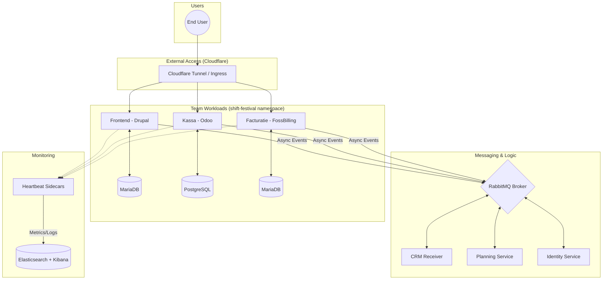
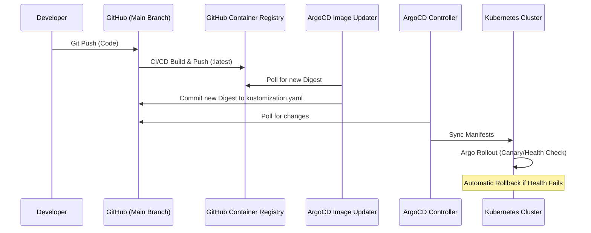

# Shift Festival — Kubernetes Infrastructure Documentation

This document is the team reference for the Shift Festival Kubernetes
infrastructure. It is meant to be read alongside `README.md`.

---

## 1. System overview

Shift Festival is a multi-team application platform deployed on a single
Kubernetes cluster. Three product teams (Frontend, Kassa, Facturatie) each run
an application + database, glued together by a central message broker
(RabbitMQ) and a shared monitoring stack.

### High-level Dataflow

---

## 2. Layered architecture

The deployment is managed with **Kustomize** using a flattened root structure for maximum transparency and GitOps stability.

### GitOps Flow

---

## 3. Conventions

### Namespace
- `shift-festival` — Application workloads.
- `argocd` — GitOps management.
- `argo-rollouts` — Rollout controller.

### Common labels
- `project: shift-festival`
- `managed-by: Team-Infra`
- `app: <service-name>`

---

## 4. Component reference

Refer to `README.md` for the full port-allocation and service list.
