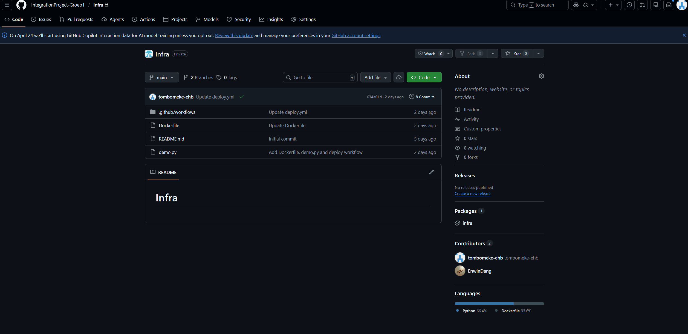

# Team Infra - Integration Project Groep 1

Welkom in de centrale repository van Team Infrastructuur. Deze repository bevat geen applicatiecode, maar is de ruggengraat van ons project. Hier beheren we de deployment flows, server configuraties en documentatie voor alle development teams.

## Wat zit er in deze repository?

* **`.github/workflows/deploy.yml`**: Onze universele CI/CD pipeline. Dit is de master-template die alle teams gebruiken om hun code naar de GitHub Container Registry (GHCR) te pushen.
* **Server Configuraties**: De centrale `docker-compose.yml` en configuraties voor onze core-infrastructuur (zoals RabbitMQ, Nginx en Dozzle) die op de productie-VM draaien.

---

## De Deployment Flow (Hoe het werkt)

Om het voor alle teams zo makkelijk mogelijk te maken, hebben we het deployment proces volledig geautomatiseerd:

1. **Push & Tag**: Een team pusht hun code en maakt een GitHub Release (Tag) aan.
2. **Build**: Onze `deploy.yml` pipeline pakt dit op, leest de lokale `Dockerfile` en bouwt een image.
3. **Registry**: De image wordt als *Internal* package opgeslagen in onze GHCR (`ghcr.io/integrationproject-groep1/[servicenaam]`).
4. **Productie**: Onze Linux VM pullt de nieuwste images en beheert de containers via onze centrale Docker Compose file.

### Hoe maak je een Tagged Release?
Om de pipeline te triggeren, hoef je alleen maar een nieuwe Tag/Release aan te maken in GitHub. Bekijk de onderstaande demo:

---

## Instructies voor Development Teams

Willen jullie je applicatie live zetten op de VM? Zorg dan dat jullie repository aan de volgende eisen voldoet:

- [ ] **Dockerfile**: Plaats een werkende `Dockerfile` in de root van jullie project. Test lokaal of deze succesvol bouwt!
- [ ] **Poort (`EXPOSE`)**: Vermeld duidelijk op welke interne poort jullie app draait (gebruik `EXPOSE [poort]` in de Dockerfile of zet het in je `.env.example`). Wij hebben dit nodig voor de routing op de VM.
- [ ] **.env.example**: Zorg voor een duidelijke `.env.example` file met daarin alle benodigde variabelen, maar **zonder** echte wachtwoorden.
- [ ] **.gitignore & .dockerignore**: Zorg dat gevoelige bestanden (`.env`, `node_modules`, `.git`) worden genegeerd.
- [ ] **CI Pipeline**: Voorzie zelf een test/linting pipeline die draait op jullie repo.
- [ ] **Deploy Pipeline**: Kopieer simpelweg onze `deploy.yml` naar jullie `.github/workflows/` map. Je hoeft zelf **geen** labels of servicenamen aan te passen, dit gaat automatisch.

Hebben jullie speciale configuraties nodig (zoals extra volumes, sidecars of een database)? Bezorg ons dan jullie lokale `docker-compose.yml`, dan verwerken wij dit in de master file op de VM.