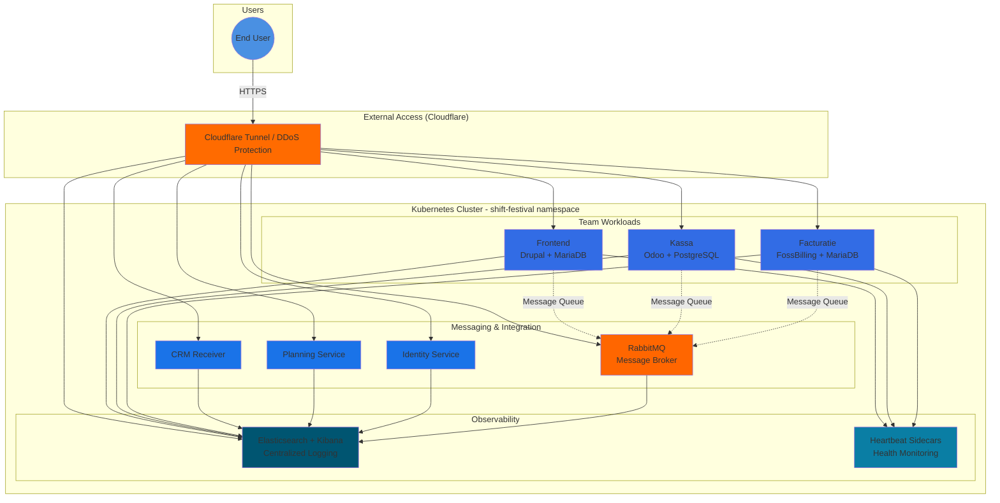
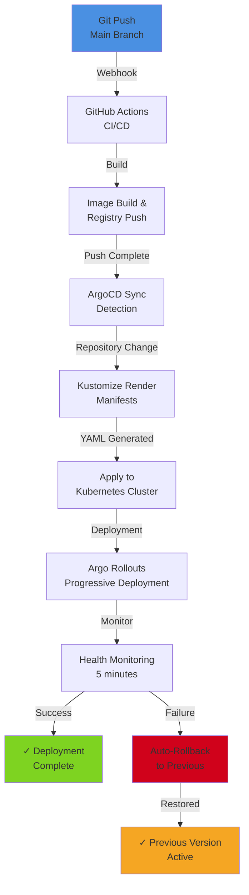
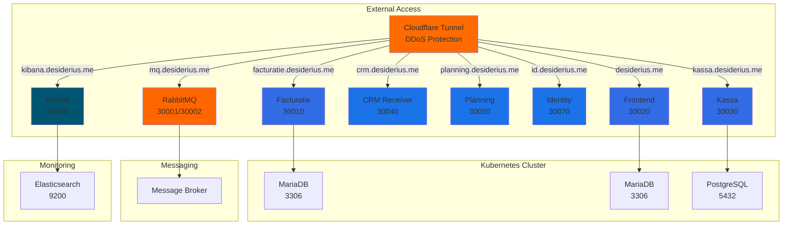
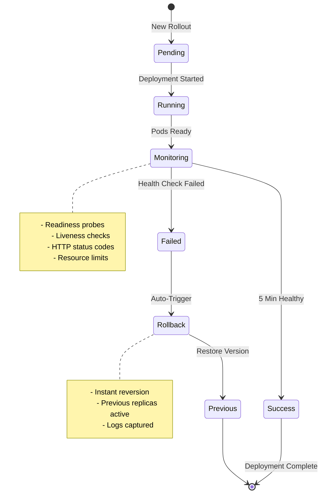
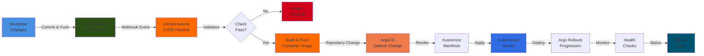
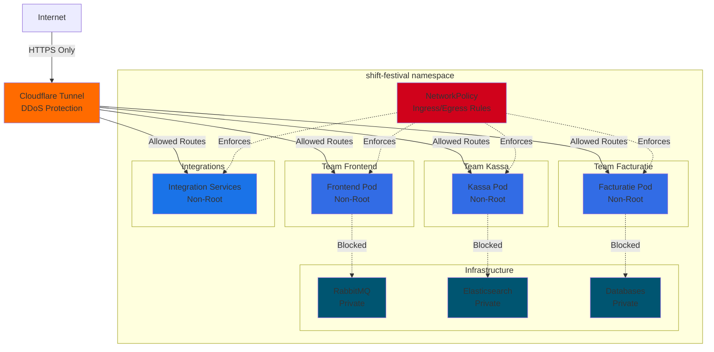
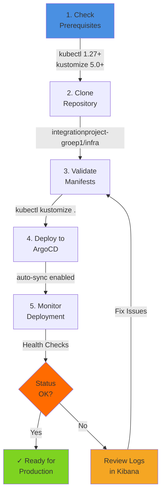
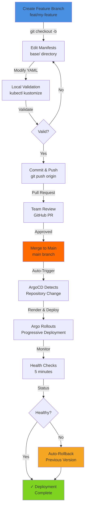

<!-- Shift Festival - Kubernetes Infrastructure Repository -->

<p align="center">
  
</p>

<p align="center">
  
  
  
  
  
  
</p>

**Production-Ready Infrastructure** | **GitOps-Driven** | **Automated Deployments** | **Multi-Tenant**

<p align="center">
  
  
  
  
  
  
</p>

---

## Overview

ShiftFestival Infra is a production-grade Kubernetes infrastructure repository that orchestrates a multi-team application ecosystem. This GitOps-driven platform manages containerized microservices, databases, and messaging infrastructure through declarative configuration and automated deployment strategies.

**Key Features:**
- Declarative infrastructure-as-code using Kustomize and Kubernetes manifests
- Continuous deployment via ArgoCD with GitOps principles
- Automated rollback mechanisms with Argo Rollouts
- Centralized observability through ELK Stack (Elasticsearch, Logstash, Kibana)
- Secure multi-tenant namespace isolation
- Non-root container execution and secret management

---

## Table of Contents

- [Quick Start](#quick-start)
- [Architecture](#architecture)
  - [System Overview](#system-overview)
  - [Deployment Pipeline](#deployment-pipeline)
  - [Service Registry](#service-registry)
  - [Service Architecture](#service-architecture)
- [Deployment Strategy](#deployment-strategy)
  - [Progressive Rollout](#progressive-rollout-with-argo-rollouts)
- [Security Standards](#security-standards)
  - [GitOps Workflow](#gitops-workflow)
  - [Network Security](#network-security)
- [Installation & Setup](#installation--setup)
- [Development Workflow](#development-workflow)
- [Troubleshooting](#troubleshooting)
- [Monitoring & Observability](#monitoring--observability)
- [Technology Stack](#technology-stack)

---

## Quick Start

**Prerequisites:**
- kubectl 1.27+ installed and configured
- Access to ShiftFestival Kubernetes cluster
- ArgoCD dashboard access

```bash
# 1. Validate and render manifests locally
kubectl kustomize .

# 2. Deploy through GitOps workflow
git add . && git commit -m "feat: your change" && git push origin main

# 3. Monitor deployment in ArgoCD
# Visit https://argocd.desiderius.me
```

---

## Architecture

### System Overview


```mermaid
graph TB
    subgraph Users
        User((End User))
    end

    subgraph "External Access (Cloudflare)"
        CF[Cloudflare Tunnel / DDoS Protection]
    end

    subgraph "Kubernetes Cluster - shift-festival namespace"
        subgraph "Team Workloads"
            Frontend["Frontend<br/>Drupal + MariaDB"]
            Kassa["Kassa<br/>Odoo + PostgreSQL"]
            Facturatie["Facturatie<br/>FossBilling + MariaDB"]
        end
        
        subgraph "Messaging & Integration"
            MQ["RabbitMQ<br/>Message Broker"]
            CRM["CRM Receiver"]
            Plan["Planning Service"]
            Ident["Identity Service"]
        end
        
        subgraph "Observability"
            ELK["Elasticsearch + Kibana<br/>Centralized Logging"]
            HB["Heartbeat Sidecars<br/>Health Monitoring"]
        end
    end
    
    User -->|HTTPS| CF
    CF --> Frontend
    CF --> Kassa
    CF --> Facturatie
    CF --> CRM
    CF --> Plan
    CF --> Ident
    CF --> ELK
    CF --> MQ
    
    Frontend -.Message Queue.-> MQ
    Kassa -.Message Queue.-> MQ
    Facturatie -.Message Queue.-> MQ
    
    Frontend & Kassa & Facturatie & CRM & Plan & Ident & MQ --> ELK
    Frontend & Kassa & Facturatie --> HB
    
    style CF fill:#FF6B00
    style MQ fill:#FF6600
    style ELK fill:#005571
    style Frontend fill:#326CE5
    style Kassa fill:#326CE5
    style Facturatie fill:#326CE5
    style CRM fill:#1A73E8
    style Plan fill:#1A73E8
    style Ident fill:#1A73E8
    style HB fill:#0A7EA4
    style User fill:#4A90E2
```

### System Components

| Component | Purpose | Port | Status |
|-----------|---------|------|--------|
| **RabbitMQ** | Message Broker | 5672 / 15672 | Core |
| **PostgreSQL** | Relational DB (Kassa) | 5432 | Shared |
| **MariaDB** | Relational DB (Drupal, FossBilling) | 3306 | Shared |
| **Elasticsearch** | Log Aggregation | 9200 | Observability |
| **Logstash** | Log Processing | 5000 | Observability |
| **Kibana** | Visualization | 5601 | Observability |
| **Cloudflared** | Tunnel Ingress | N/A | Networking |
| **ArgoCD** | GitOps Controller | 8080 / 443 | Management |
| **Argo Rollouts** | Progressive Deployment | N/A | Management |

### Deployment Pipeline


```mermaid
graph TD
    A["Git Push<br/>Main Branch"] -->|Webhook| B["GitHub Actions<br/>CI/CD"]
    B -->|Build| C["Image Build &<br/>Registry Push"]
    C -->|Push Complete| D["ArgoCD Sync<br/>Detection"]
    D -->|Repository Change| E["Kustomize Render<br/>Manifests"]
    E -->|YAML Generated| F["Apply to<br/>Kubernetes Cluster"]
    F -->|Deployment| G["Argo Rollouts<br/>Progressive Deployment"]
    G -->|Monitor| H["Health Monitoring<br/>5 minutes"]
    H -->|Success| I["✓ Deployment<br/>Complete"]
    H -->|Failure| J["Auto-Rollback<br/>to Previous"]
    J -->|Restored| K["✓ Previous Version<br/>Active"]
    
    style A fill:#4A90E2
    style I fill:#7ED321
    style K fill:#F5A623
    style J fill:#D0021B
```

---

## Repository Structure

```
Infra/
├── README.md                    # Documentation (this file)
├── DOCUMENTATION.md             # Architecture & system overview
├── SECURITY.md                  # Security policies & constraints
├── CLAUDE.md                    # AI context guidelines
├── kustomization.yaml           # Root Kustomization & image overrides
│
├── base/                        # Core Kubernetes manifests
│   ├── namespace.yaml           # Namespace creation
│   ├── kustomization.yaml       # Base resource aggregation
│   │
│   ├── setup/                   # Infrastructure setup
│   │   ├── storage.yaml         # PersistentVolume claims
│   │   ├── configmaps.yaml      # Global configuration
│   │   └── kustomization.yaml
│   │
│   ├── core/                    # Core services
│   │   ├── rabbitmq.yaml        # Message broker deployment
│   │   ├── postgres.yaml        # PostgreSQL database
│   │   ├── cloudflared.yaml     # Tunnel ingress
│   │   ├── kubernetes-dashboard.yaml
│   │   ├── ingress/             # Ingress controller (nginx)
│   │   └── kustomization.yaml
│   │
│   ├── monitoring/              # ELK Stack
│   │   ├── elasticsearch.yaml
│   │   ├── logstash.yaml        # Log processing pipeline
│   │   ├── kibana.yaml          # Visualization interface
│   │   ├── elastic-agent.yaml   # Metrics collection
│   │   ├── heartbeat.yaml       # Uptime monitoring
│   │   └── kustomization.yaml
│   │
│   ├── integrations/            # Integration services
│   │   ├── crm.yaml             # CRM receiver
│   │   ├── planning.yaml        # Planning service
│   │   ├── identity-service.yaml # Identity provider
│   │   ├── mailing.yaml         # Mailing service
│   │   └── kustomization.yaml
│   │
│   ├── team-frontend/           # Drupal + MariaDB
│   │   ├── drupal.yaml          # Drupal Rollout
│   │   ├── mariadb.yaml         # Database
│   │   ├── proxy.yaml           # Proxy sidecar
│   │   ├── ingress.yaml         # Ingress rules
│   │   └── kustomization.yaml
│   │
│   ├── team-kassa/              # Odoo + PostgreSQL
│   │   ├── odoo.yaml            # Odoo Rollout
│   │   ├── postgres.yaml        # Database
│   │   ├── integration.yaml     # CRM integration
│   │   ├── proxy.yaml           # Proxy sidecar
│   │   ├── ingress.yaml         # Ingress rules
│   │   └── kustomization.yaml
│   │
│   └── team-facturatie/         # FossBilling + MariaDB
│       ├── fossbilling.yaml     # FossBilling Rollout
│       ├── mariadb.yaml         # Database
│       ├── mariadb-config.yaml  # Database config
│       ├── apache-config.yaml   # Apache configuration
│       ├── proxy.yaml           # Proxy sidecar
│       ├── ingress.yaml         # Ingress rules
│       └── kustomization.yaml
│
├── argocd/                      # GitOps management
│   ├── namespace.yaml           # ArgoCD namespace
│   ├── install.yaml             # ArgoCD installation
│   ├── kustomization.yaml       # ArgoCD resources
│   ├── README.md                # ArgoCD setup guide
│   │
│   ├── applications/            # Application definitions
│   │   ├── prod-app.yaml        # Production app manifest
│   │   └── kustomization.yaml
│   │
│   ├── image-updater/           # Automated image updates
│   │   ├── install.yaml
│   │   └── kustomization.yaml
│   │
│   └── rollouts/                # Argo Rollouts controller
│       ├── kustomization.yaml
│       └── install.yaml
│
├── scripts/                     # Helper utilities
│   ├── README.md                # Scripts documentation
│   ├── create-secret.sh         # Secret management
│   ├── check-image-versions.sh  # Image version checker
│   ├── check-image-versions.ps1 # PowerShell variant
│   ├── runtime-rollback.sh      # Manual rollback utility
│   ├── test-rollback.sh         # Rollback testing
│   ├── notify-teams.sh          # Notification system
│   ├── migrate_identity_service.py
│   └── check-image-versions-vm.sh
│
├── pipelines/                   # CI/CD workflows
│   ├── ci.yml                   # Build & test pipeline
│   └── deploy.yml               # Deployment pipeline
│
├── docs/                        # Additional documentation
│   ├── how-it-works.md          # System workflow explanation
│   └── argocd-setup.md          # ArgoCD configuration guide
│
├── assets/                      # Documentation assets

    ├── banners.md               # Banner templates
    └── badges/                  # Custom badge definitions
        ├── namespace.svg
        ├── rollback.svg
        ├── strategy.svg
        └── teams.svg
```

---

## Service Registry

Every team has an assigned NodePort range. Services are accessible internally via `ClusterIP` and externally via `NodePort` or `Cloudflare Tunnel`.

| Team | Service Name | Internal Port | NodePort | URL (External) |
| :--- | :--- | :--- | :--- | :--- |
| **Facturatie** | `facturatie-app-service` | 80 | `30010` | `facturatie.desiderius.me` |
| | `facturatie-db-service` | 3306 | — | — |
| **Frontend** | `frontend-drupal-service` | 80 | `30020` | `desiderius.me` |
| | `frontend-db-service` | 3306 | — | — |
| **Kassa** | `kassa-web-service` | 8069 | `30030` | `kassa.desiderius.me` |
| | `kassa-db-service` | 5432 | — | — |
| **Integratie** | `crm-receiver-service` | 80 | `30040` | `crm.desiderius.me` |
| | `planning-service` | 80 | `30050` | `planning.desiderius.me` |
| | `identity-service` | 8000 | `30070` | `id.desiderius.me` |
| **Infra** | `rabbitmq-service` | 5672, 15672 | `30001`, `30002` | `mq.desiderius.me` |
| | `kibana-service` | 5601 | `30060` | `kibana.desiderius.me` |
| | `argocd-server` | 80, 443 | — | `argocd.desiderius.me` |

### Service Architecture


```mermaid
graph TB
    CF["Cloudflare Tunnel<br/>DDoS Protection"]
    
    subgraph "External Access"
        CF -->|facturatie.desiderius.me| FE["Facturatie<br/>30010"]
        CF -->|desiderius.me| FD["Frontend<br/>30020"]
        CF -->|kassa.desiderius.me| KA["Kassa<br/>30030"]
        CF -->|crm.desiderius.me| CRM["CRM Receiver<br/>30040"]
        CF -->|planning.desiderius.me| PL["Planning<br/>30050"]
        CF -->|id.desiderius.me| ID["Identity<br/>30070"]
        CF -->|kibana.desiderius.me| KB["Kibana<br/>30060"]
        CF -->|mq.desiderius.me| MQ["RabbitMQ<br/>30001/30002"]
    end
    
    subgraph "Kubernetes Cluster"
        FE --> FDB["MariaDB<br/>3306"]
        FD --> FRMDB["MariaDB<br/>3306"]
        KA --> KPGDB["PostgreSQL<br/>5432"]
    end
    
    subgraph "Messaging"
        MQ --> RMQB["Message Broker"]
    end
    
    subgraph "Monitoring"
        KB --> ES["Elasticsearch<br/>9200"]
    end
    
    style CF fill:#FF6B00
    style FE fill:#326CE5
    style FD fill:#326CE5
    style KA fill:#326CE5
    style CRM fill:#1A73E8
    style PL fill:#1A73E8
    style ID fill:#1A73E8
    style KB fill:#005571
    style MQ fill:#FF6600
```

---

## Deployment Strategy

### Progressive Rollout with Argo Rollouts

This repository uses **Argo Rollouts** for safe, automated deployments with automatic rollback capabilities.


```mermaid
stateDiagram-v2
    [*] --> Pending: New Rollout
    Pending --> Running: Deployment Started
    Running --> Monitoring: Pods Ready
    
    Monitoring --> Success: 5 Min Healthy
    Monitoring --> Failed: Health Check Failed
    
    Failed --> Rollback: Auto-Trigger
    Rollback --> Previous: Restore Version
    Previous --> [*]
    
    Success --> [*]: Deployment Complete
    
    note right of Monitoring
        - Readiness probes
        - Liveness checks
        - HTTP status codes
        - Resource limits
    end note
    
    note right of Rollback
        - Instant reversion
        - Previous replicas active
        - Logs captured
    end note
```

**Health Monitoring Process:**

1. **Detection Phase (0-5 minutes)**
   - Controller monitors newly deployed pods
   - Readiness probes validate container health
   - Liveness probes detect pod crashes

2. **Auto-Rollback Triggers**
   - Pod enters CrashLoopBackOff state
   - Readiness probe fails consecutively
   - Memory/CPU limits exceeded
   - Application returns HTTP 5xx errors

3. **Observability**
   - All rollout events logged to Elasticsearch
   - Kibana dashboards display real-time metrics
   - Heartbeat monitors service availability
   - Logs retained for post-mortem analysis

**Manual Rollback:**
```bash
# Emergency rollback to previous revision
./scripts/runtime-rollback.sh <deployment-name>

# Test rollback without deployment
./scripts/test-rollback.sh <deployment-name>
```

---

## Security Standards

### GitOps Workflow


```mermaid
graph LR
    A["Developer<br/>Changes"] -->|Commit & Push| B["Git Repository<br/>main branch"]
    B -->|Webhook Event| C["GitHub Actions<br/>CI/CD Pipeline"]
    C -->|Validates| D{Check<br/>Pass?}
    D -->|No| E["Reject<br/>Changes"]
    D -->|Yes| F["Build & Push<br/>Container Image"]
    F -->|Repository Change| G["ArgoCD<br/>Detects Change"]
    G -->|Render| H["Kustomize<br/>Manifests"]
    H -->|Apply| I["Kubernetes<br/>Cluster"]
    I -->|Deploy| J["Argo Rollouts<br/>Progression"]
    J -->|Monitor| K["Health<br/>Checks"]
    K -->|Status| L["Kibana<br/>Logs"]
    
    style A fill:#4A90E2
    style B fill:#2D5016
    style C fill:#FF6B00
    style E fill:#D0021B
    style F fill:#FF6B00
    style G fill:#EF7B4D
    style I fill:#326CE5
    style L fill:#005571
```

### Container Security
- All containers run as non-root user (UID/GID > 1000)
- Read-only root filesystem enforced where possible
- No privileged containers in production
- Security context applied to all deployments

### Secret Management
- Secrets stored in Kubernetes Secret resource
- Encrypted at rest in etcd
- Use provided script for safe updates:
  ```bash
  ./scripts/create-secret.sh
  ```
- Never commit `.env` files or secrets to repository

### GitOps Governance
- **Do not** use `kubectl apply` or `kubectl patch` manually
- All changes must flow through Git repository
- ArgoCD enforces declarative state synchronization
- Changes require Git commit + Push to main branch
- Signed commits recommended for audit trail

### Network Security


```mermaid
graph TB
    Internet["Internet"]
    CF["Cloudflare Tunnel<br/>DDoS Protection"]
    
    Internet -->|HTTPS Only| CF
    
    subgraph "shift-festival namespace"
        subgraph "Team Frontend"
            TFE["Frontend Pod<br/>Non-Root"]
        end
        
        subgraph "Team Kassa"
            TKA["Kassa Pod<br/>Non-Root"]
        end
        
        subgraph "Team Facturatie"
            TFA["Facturatie Pod<br/>Non-Root"]
        end
        
        subgraph "Integrations"
            INT["Integration Services<br/>Non-Root"]
        end
        
        subgraph "Infrastructure"
            MQ["RabbitMQ<br/>Private"]
            ELK["Elasticsearch<br/>Private"]
            DB["Databases<br/>Private"]
        end
        
        NP["NetworkPolicy<br/>Ingress/Egress Rules"]
    end
    
    CF -->|Allowed Routes| TFE
    CF -->|Allowed Routes| TKA
    CF -->|Allowed Routes| TFA
    CF -->|Allowed Routes| INT
    
    TFE -.->|Blocked| MQ
    TKA -.->|Blocked| ELK
    TFA -.->|Blocked| DB
    
    NP -.->|Enforces| TFE
    NP -.->|Enforces| TKA
    NP -.->|Enforces| TFA
    NP -.->|Enforces| INT
    
    style CF fill:#FF6B00
    style NP fill:#D0021B
    style MQ fill:#005571
    style ELK fill:#005571
    style DB fill:#005571
    style TFE fill:#326CE5
    style TKA fill:#326CE5
    style TFA fill:#326CE5
    style INT fill:#1A73E8
```

**Key Policies:**
- Namespace-level isolation enforced
- Network policies restrict inter-pod communication
- Ingress via Cloudflare Tunnel (DDoS protection)
- TLS/SSL on all external endpoints
- Database ports not exposed externally
- All containers run as non-root
- Read-only root filesystem where possible

---

## Installation & Setup

### Deployment Checklist


```mermaid
graph TD
    A["1. Check<br/>Prerequisites"] -->|kubectl 1.27+<br/>kustomize 5.0+| B["2. Clone<br/>Repository"]
    B -->|integrationproject-groep1/infra| C["3. Validate<br/>Manifests"]
    C -->|kubectl kustomize .| D["4. Deploy to<br/>ArgoCD"]
    D -->|auto-sync enabled| E["5. Monitor<br/>Deployment"]
    E -->|Health Checks| F{Status<br/>OK?}
    F -->|Yes| G["✓ Ready for<br/>Production"]
    F -->|No| H["Review Logs<br/>in Kibana"]
    H -->|Fix Issues| C
    
    style A fill:#4A90E2
    style G fill:#7ED321
    style H fill:#F5A623
    style F fill:#FF6B00
```

### Prerequisites
```bash
# Check environment
kubectl version --client  # 1.27+
kustomize version         # 5.0+

# Verify cluster access
kubectl cluster-info
kubectl auth can-i create deployments --namespace shift-festival
```

### Initial Deployment

1. **Clone Repository**
   ```bash
   git clone https://github.com/integrationproject-groep1/infra.git
   cd infra
   ```

2. **Validate Manifests**
   ```bash
   # Render all manifests locally
   kubectl kustomize . > manifests.yaml
   
   # Validate YAML structure
   kubectl apply --dry-run=client -f manifests.yaml
   ```

3. **Deploy via ArgoCD** (Recommended)
   - Access ArgoCD at `https://argocd.desiderius.me`
   - Create Application pointing to this repository
   - Enable auto-sync for continuous deployment

   Or deploy manually:
   ```bash
   kubectl apply -k .
   ```

4. **Verify Deployment**
   ```bash
   kubectl get namespaces
   kubectl get pods -n shift-festival
   kubectl get services -A
   ```

---

## Troubleshooting

### View Pod Logs
```bash
# Stream logs from specific pod
kubectl logs -f <pod-name> -n shift-festival

# View logs from all containers in namespace
kubectl logs -n shift-festival --tail=100 -l app=<label>

# Search logs in Kibana
# Visit: https://kibana.desiderius.me
```

### Check Deployment Status
```bash
# Detailed deployment information
kubectl describe deployment <deployment-name> -n shift-festival

# Argo Rollout status
kubectl argo rollouts get rollout <rollout-name> -n shift-festival

# View rollout history
kubectl argo rollouts history <rollout-name> -n shift-festival
```

### Database Connectivity
```bash
# PostgreSQL test
kubectl run -it --rm psql --image=postgres:15 -- \
  psql -h postgres-service -U postgres -c "\dt"

# MariaDB test
kubectl run -it --rm mariadb --image=mariadb:11 -- \
  mysql -h mariadb-service -u root -p<password>
```

### RabbitMQ Management
```bash
# Access RabbitMQ Management UI
# Visit: http://mq.desiderius.me (via tunnel)
# Or: http://localhost:15672 (port-forward)

# Port-forward to local machine
kubectl port-forward svc/rabbitmq-service 15672:15672 -n shift-festival
```

---

## Development Workflow

### Git & Deployment Flow


```mermaid
graph TD
    A["Create Feature Branch<br/>feat/my-feature"] -->|git checkout -b| B["Edit Manifests<br/>base/ directory"]
    B -->|Modify YAML| C["Local Validation<br/>kubectl kustomize"]
    C -->|Validate| D{Valid?}
    D -->|No| B
    D -->|Yes| E["Commit & Push<br/>git push origin"]
    E -->|Pull Request| F["Team Review<br/>GitHub PR"]
    F -->|Approved| G["Merge to Main<br/>main branch"]
    G -->|Auto-Trigger| H["ArgoCD Detects<br/>Repository Change"]
    H -->|Render & Deploy| I["Argo Rollouts<br/>Progressive Deployment"]
    I -->|Monitor| J["Health Checks<br/>5 minutes"]
    J -->|Status| K{Healthy?}
    K -->|Yes| L["✓ Deployment<br/>Complete"]
    K -->|No| M["Auto-Rollback<br/>Previous Version"]
    M --> L
    
    style A fill:#4A90E2
    style L fill:#7ED321
    style M fill:#F5A623
    style G fill:#FF6B00
```

### Making Changes

1. **Create Feature Branch**
   ```bash
   git checkout -b feat/my-feature
   ```

2. **Edit Manifests**
   - Modify YAML files in `base/` directory
   - Update `kustomization.yaml` if adding resources

3. **Local Validation**
   ```bash
   kubectl kustomize . | kubectl apply --dry-run=client -f -
   ```

4. **Commit & Push**
   ```bash
   git add .
   git commit -m "feat: description of change"
   git push origin feat/my-feature
   ```

5. **Create Pull Request**
   - Request review from team
   - Automated CI/CD will validate

6. **Merge to Main**
   - ArgoCD automatically deploys changes
   - Monitor deployment in ArgoCD dashboard

### Best Practices
- Use semantic versioning for releases
- Document breaking changes in commit message
- Test manifest changes locally before push
- Keep secrets out of repository
- Use resource labels for filtering (`team: frontend`, etc.)

---

## Monitoring & Observability

### ELK Stack Access

| Service | URL | Purpose |
|---------|-----|---------|
| Kibana | `https://kibana.desiderius.me` | Log search & visualization |
| Elasticsearch | `http://elasticsearch-service:9200` | Log storage (internal) |
| Logstash | Internal only | Log processing pipeline |

### Key Dashboards
- Pod health and status
- Service response times
- Error rate trends
- Resource utilization (CPU, memory)
- Deployment audit trails

### Alerting
- Configure alerts in Kibana for critical errors
- Integrate with Slack/Teams for notifications
- Review logs from failed deployments
- Archive logs for compliance

---

## Support & Documentation

| Resource | Link | Purpose |
|----------|------|---------|
| Architecture Docs | `DOCUMENTATION.md` | System design & dataflow |
| Security Policy | `SECURITY.md` | Security guidelines |
| ArgoCD Setup | `docs/argocd-setup.md` | GitOps configuration |
| How It Works | `docs/how-it-works.md` | Component interaction |
| AI Context | `CLAUDE.md` | AI/LLM guidelines |

### Getting Help
- Review documentation files above
- Check existing issues on GitHub
- Contact Team Infra for infrastructure questions
- File bug reports with full context (logs, manifests, etc.)

---

## Backup & Disaster Recovery

All 6 databases are backed up daily to a separate backup VM via the `backup.yml` GitHub Actions workflow (runs at 02:00 UTC). The Infra Git repo is mirrored there as well.

| What | Frequency | Location |
|---|---|---|
| 6 databases (pg_dump / mysqldump) | Daily 02:00 UTC | `integration.switzerlandnorth.cloudapp.azure.com:~/backups/databases/` |
| Git mirror | Daily 02:00 UTC | `~/git-mirrors/infra.git` |
| Secrets (`.env`, GPG-encrypted) | Daily 02:00 UTC | `~/secrets/shift-festival.env.gpg` |
| RabbitMQ definitions (GPG-encrypted) | Daily 02:00 UTC | `~/secrets/rabbitmq-definitions.gpg` |
| Cloudflare tunnel token (GPG-encrypted) | Daily 02:00 UTC | `~/secrets/cloudflare-tunnel.gpg` |

**Estimated recovery time after full VM loss: 30–60 minutes.**

> **Note — ELK Stack on the backup VM:** The backup VM has fewer resources than the primary VM. Elasticsearch requires at least 1 GB of JVM heap and typically uses 2–3 GB of RAM in production. If the backup VM runs out of CPU or memory, start by scaling down ELK first so the application pods can start:
> ```bash
> kubectl scale deployment elasticsearch-deployment logstash-deployment kibana-deployment \
>   elastic-agent-deployment heartbeat-deployment --replicas=0 -n shift-festival
> ```
> Logging is unavailable in this reduced mode but all application services (databases, RabbitMQ, team workloads, Cloudflare tunnel) will run normally. Re-enable ELK only if the backup VM has enough headroom.

See [docs/disaster-recovery.md](docs/disaster-recovery.md) for the full step-by-step recovery guide.

---

## Technology Stack

| Category | Technology | Version |
|----------|-----------|---------|
| **Orchestration** | Kubernetes | 1.27+ |
| **Config Management** | Kustomize | 5.0+ |
| **GitOps** | ArgoCD | 2.8+ |
| **Deployment** | Argo Rollouts | 1.5+ |
| **Messaging** | RabbitMQ | 3.12+ |
| **Databases** | PostgreSQL 15, MariaDB 11 | Latest |
| **Monitoring** | Elasticsearch, Logstash, Kibana | 8.10+ |
| **Networking** | Cloudflare Tunnel, Nginx Ingress | Latest |
| **CI/CD** | GitHub Actions | Native |

---

## License

This project is licensed under the MIT License - see the LICENSE file for details.

---

## Team

**Shift Festival - Team Infra**

Infrastructure maintained by the Integration Project team. For questions or contributions, contact the team leads or create an issue on the repository.

**Last Updated:** May 2026  
**Kubernetes Version:** 1.27+  
**Kustomize Version:** 5.0+
