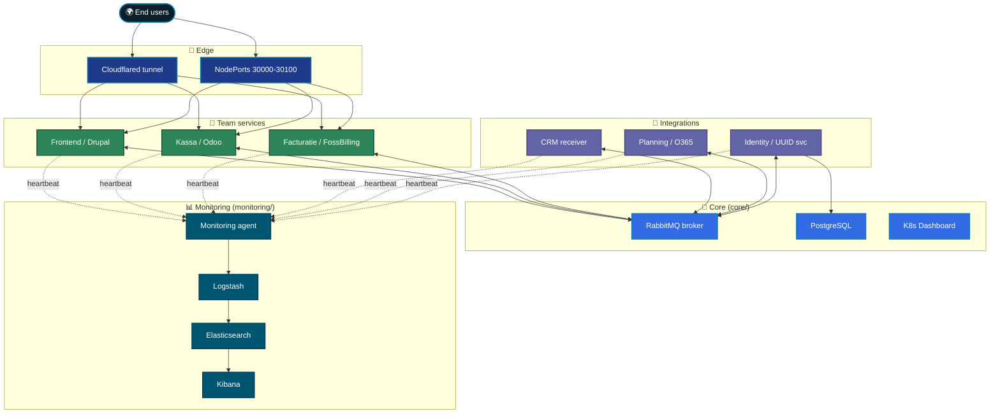

<!-- =================================================================== -->
<!--  ShiftFestival · Team Infra · README                                -->
<!--  Banner generated via kyechan99/capsule-render                      -->
<!-- =================================================================== -->

<p align="center">
  
</p>

<p align="center">
  <a href="#"></a>
  <a href="#"></a>
  <a href="#"></a>
  <a href="#"></a>
  <a href="#"></a>
  <a href="#"></a>
  <a href="#"></a>
</p>

<p align="center">
  <a href="../../actions/workflows/ci.yml"></a>
  <a href="../../actions/workflows/deploy.yml"></a>
  <a href="SECURITY.md"></a>
  <a href="DOCUMENTATION.md"></a>
  <a href="#"></a>
  <a href="#"></a>
</p>

<p align="center">
  <em>Central infrastructure repository for the <strong>ShiftFestival</strong> integration project.</em><br/>
  <em>Kubernetes manifests, Kustomize layers, GitHub Actions and operational runbooks — all in one place.</em>
</p>

---

## Table of Contents

1. [Why this repo exists](#why-this-repo-exists)
2. [Quick Start](#quick-start)
3. [Architecture at a Glance](#architecture-at-a-glance)
4. [Repository Layout](#repository-layout)
5. [CI/CD Pipeline](#cicd-pipeline)
6. [Deployment & Operations](#deployment--operations)
7. [NodePort Allocation](#nodeport-allocation)
8. [Conventions for Teams](#conventions-for-teams)
9. [Adding a New Service](#adding-a-new-service)
10. [Rollback & Recovery](#rollback--recovery)
11. [Documentation Rules](#documentation-rules)
12. [Maintainers & Support](#maintainers--support)

---

## Why this repo exists

ShiftFestival is a multi-team integration project where six teams build independent applications that must talk to one another reliably. **Team Infra** owns the platform layer that makes this possible:

- A single Kubernetes cluster running every team's workload in the `shift-festival` namespace.
- A central RabbitMQ broker for asynchronous, team-prefixed messaging.
- A shared observability stack (Elasticsearch + Logstash + Kibana) so any team can debug their flows.
- A reproducible, GitOps-style deploy pipeline — **the VM is never edited by hand**.

Everything in this repository is rendered with `kubectl kustomize .`. If it does not render, it does not deploy.

---

## Quick Start

> **Prerequisite:** Create a local `setup/.env` with dummy or real values before rendering. Kustomize's `secretGenerator` in `setup/kustomization.yaml` requires that file. **Never commit it.**

```bash
# 1. Render manifests locally
kubectl kustomize .

# 2. Validate without applying
kubectl apply -k . --dry-run=client

# 3. Lint YAML
find . -type f \( -name "*.yml" -o -name "*.yaml" \) -not -path "./.git/*" -print0 | xargs -0 yamllint

# 4. Lint shell scripts
shellcheck scripts/*.sh

# 5. Deploy (only after CI passes; usually triggered by a push to main)
kubectl apply -k .

# 6. Verify
kubectl get pods -n shift-festival
kubectl get svc  -n shift-festival
```

For an emergency manual deploy, use **GitHub Actions → "Deploy Infra to Kubernetes" → Run workflow → main**.

---

## Architecture at a Glance


```mermaid
flowchart TB
    classDef external fill:#0b1f2a,color:#fff,stroke:#0a7ea4,stroke-width:2px;
    classDef edge     fill:#1e3a8a,color:#fff,stroke:#0a7ea4,stroke-width:2px;
    classDef core     fill:#326CE5,color:#fff,stroke:#0a7ea4,stroke-width:2px;
    classDef team     fill:#2f855a,color:#fff,stroke:#1a5738,stroke-width:2px;
    classDef integ    fill:#6264a7,color:#fff,stroke:#4a4880,stroke-width:2px;
    classDef monitor  fill:#005571,color:#fff,stroke:#004058,stroke-width:2px;

    USER([🌍 End users]):::external

    subgraph EDGE["🚪 Edge"]
        CF[Cloudflared tunnel]:::edge
        NP[NodePorts 30000-30100]:::edge
    end

    subgraph CORE["🧠 Core (core/)"]
        RMQ[RabbitMQ broker]:::core
        PG[PostgreSQL]:::core
        DASH[K8s Dashboard]:::core
    end

    subgraph TEAMS["👥 Team services"]
        FE[Frontend / Drupal]:::team
        KAS[Kassa / Odoo]:::team
        FAC[Facturatie / FossBilling]:::team
    end

    subgraph INTEG["🔌 Integrations"]
        CRM[CRM receiver]:::integ
        PLAN[Planning / O365]:::integ
        ID[Identity / UUID svc]:::integ
    end

    subgraph MON["📊 Monitoring (monitoring/)"]
        ES[Elasticsearch]:::monitor
        LS[Logstash]:::monitor
        KB[Kibana]:::monitor
        AG[Monitoring agent]:::monitor
    end

    USER --> CF
    USER --> NP
    CF --> FE & KAS & FAC
    NP --> FE & KAS & FAC

    FE  <--> RMQ
    KAS <--> RMQ
    FAC <--> RMQ
    CRM <--> RMQ
    PLAN <--> RMQ
    ID  <--> RMQ

    ID --> PG

    FE  -. heartbeat .-> AG
    KAS -. heartbeat .-> AG
    FAC -. heartbeat .-> AG
    CRM -. heartbeat .-> AG
    PLAN -. heartbeat .-> AG
    ID  -. heartbeat .-> AG

    AG --> LS --> ES --> KB
```

**Highlights**

- **One namespace** — everything lives in `shift-festival`. Keel runs in its own `keel` namespace.
- **One root `kustomization.yaml`** pulls in every layer in the right order.
- **Heartbeat sidecar pattern** — almost every team workload reports liveness over RabbitMQ for the monitoring agent to pick up.
- **Strategy: Recreate** is mandatory for any database deployment to avoid Multi-Attach errors on `ReadWriteOnce` PVCs.

---

## Repository Layout

```text
Infra/
├── kustomization.yaml          # root layer that wires everything together
├── README.md                   # this file
├── DOCUMENTATION.md            # deep architectural reference
├── SECURITY.md                 # audit findings + remediation status
├── CLAUDE.md                   # Claude Code agent guardrails
│
├── setup/                      # namespace, storage, configmaps, secretGenerator
│   ├── namespace.yaml
│   ├── storage.yaml
│   ├── configmaps.yaml
│   └── kustomization.yaml
│
├── core/                       # platform-wide services
│   ├── rabbitmq.yaml
│   ├── postgres.yaml
│   ├── cloudflared.yaml
│   ├── kubernetes-dashboard.yaml
│   └── kustomization.yaml
│
├── team-frontend/              # Drupal + MariaDB + Nginx proxy
├── team-kassa/                 # Odoo + Postgres + Nginx proxy + integration
├── team-facturatie/            # FossBilling + MariaDB + Nginx proxy
│
├── integrations/               # CRM, Planning, Identity
│   ├── crm.yaml
│   ├── planning.yaml
│   ├── identity-service.yaml
│   └── kustomization.yaml
│
├── monitoring/                 # ELK stack + monitoring agent
│   ├── elasticsearch.yaml
│   ├── kibana.yaml
│   ├── logstash.yaml
│   ├── logstash-config.yaml
│   ├── monitoring-agent.yaml
│   └── kustomization.yaml
│
├── keel/                       # image updater (separate namespace)
│   ├── keel.yaml
│   └── kustomization.yaml
│
├── pipelines/                  # build/deploy helpers
├── scripts/                    # operational shell scripts (shellcheck-clean)
└── .github/workflows/          # ci.yml + deploy.yml
```

---

## CI/CD Pipeline


```mermaid
flowchart LR
    classDef trig    fill:#0b1f2a,color:#fff,stroke:#0a7ea4,stroke-width:2px;
    classDef ci      fill:#1e3a8a,color:#fff,stroke:#0a7ea4,stroke-width:2px;
    classDef gate    fill:#f59e0b,color:#0b1f2a,stroke:#b45309,stroke-width:2px;
    classDef deploy  fill:#2f855a,color:#fff,stroke:#1a5738,stroke-width:2px;
    classDef notify  fill:#6264a7,color:#fff,stroke:#4a4880,stroke-width:2px;

    PUSH[Push / PR]:::trig --> CI

    subgraph CI["🧪 ci.yml"]
        direction TB
        K[Kustomize render]:::ci
        Y[yamllint]:::ci
        S[shellcheck]:::ci
        G[Gitleaks scan]:::ci
        T[Trivy config scan]:::ci
        E[Verify .env not committed]:::ci
    end

    CI --> GATE{Branch == main\nAND CI passed?}:::gate

    GATE -->|no| STOP([⛔ stop here]):::trig
    GATE -->|yes| DEPLOY

    subgraph DEPLOY["🚀 deploy.yml"]
        direction TB
        SCP[SCP files to VM]:::deploy
        ENV[Verify setup/.env on VM]:::deploy
        APPLY[kubectl apply -k .]:::deploy
        WAIT[Wait for rollout]:::deploy
    end

    DEPLOY --> TEAMS[📣 Teams notification]:::notify
```

**CI on every push and PR**

1. Render the Kustomize tree with `kubectl kustomize .` against a temporary local `setup/.env`.
2. Lint all YAML with `yamllint`.
3. Lint bash with `shellcheck` (`SC2034` and `SC1091` suppressed).
4. Scan git history with **Gitleaks**.
5. Scan manifests with **Trivy** in `config` mode.
6. Verify no `.env` files or hardcoded secrets are committed.

**Deploy on push to `main` (after CI passes)**

1. SCP the repo to the VM (excluding `.github/`, `assets/`, and markdown docs).
2. Verify `setup/.env` exists on the VM.
3. Run `kubectl apply -k .` from the repo root.
4. Wait for rollouts to complete and capture pod/service status.
5. Notify Teams on success or failure.

---

## Deployment & Operations

Run from the Infra repository root.

```bash
# Validate rendered manifests
kubectl kustomize .

# Validate without applying
kubectl apply -k . --dry-run=client

# Deploy all layers
kubectl apply -k .

# Verify workloads
kubectl get pods -n shift-festival
kubectl get svc  -n shift-festival

# Tail logs from a specific deployment
kubectl logs -n shift-festival deployment/<name> -f

# Remove all resources from this stack (rare!)
kubectl delete -k .
```

**Operational rules**

- Do **not** edit the VM manually — the deploy pipeline overwrites the runtime tree on each deploy.
- Real secrets only live on the VM or in the secret store, never in Git.
- Database deployments use `strategy: type: Recreate` to avoid Multi-Attach on RWO PVCs.
- Volume permissions are managed via `fsGroup` in the pod's `securityContext`. Never use `runAsUser: 0` in initContainers.

---

## NodePort Allocation

| Range          | Owner               | Notes                                  |
|----------------|---------------------|----------------------------------------|
| `30000-30009`  | Team Infra          | Reserved for platform services         |
| `30010-30019`  | Team Facturatie     | FossBilling stack                      |
| `30020-30029`  | Team Frontend       | Drupal + proxy                         |
| `30030-30039`  | Team Kassa          | Odoo + proxy                           |
| `30040-30049`  | Team CRM            | Salesforce receiver                    |
| `30050-30059`  | Team Planning       | Office 365 integration                 |
| `30060-30069`  | Team Monitoring     | Kibana / dashboards                    |
| `30070-30100`  | Identity + reserved | UUID service + future allocations      |

> **Coordinate every new public NodePort with Team Infra before merging.** Out-of-range ports are rejected by reviewer.

---

## Conventions for Teams

### RabbitMQ naming

Always use a team prefix on every queue and routing key:

| Good                          | Bad                |
|-------------------------------|--------------------|
| `kassa.orders`                | `orders`           |
| `crm.customer.created`        | `customer_queue`   |
| `planning.session.updated`    | `session.updated`  |

The shared **heartbeat** exchange is the only documented exception.

### Common labels (applied automatically by the root Kustomize layer)

- `project: shift-festival`
- `managed-by: Team-Infra`
- `app: <service-name>` — used as the selector for Services.

### Naming

- Deployments: `<team>-<role>` — e.g. `frontend-drupal`, `kassa-db`.
- Services: `<deployment-name>-service` — e.g. `frontend-db-service`.
- ConfigMaps: `<service>-<purpose>` — e.g. `kassa-nginx-config`.

---

## Adding a New Service

1. Add the manifest(s) to the correct folder in this repo.
2. Update that folder's `kustomization.yaml`.
3. Add required secrets or config keys to `setup/.env` and document them in `DOCUMENTATION.md`.
4. Add a heartbeat sidecar if the service needs liveness reporting.
5. Add a Service / NodePort **only** if the workload must be publicly exposed — coordinate the port with Team Infra.
6. Update the rollout checks in `.github/workflows/deploy.yml`.
7. Run `kubectl kustomize .` and `kubectl apply -k . --dry-run=client` locally to verify.
8. Update `README.md` (architecture section) and `CLAUDE.md` if the topology changed.

---

## Rollback & Recovery

- **Single deployment rollback:** `kubectl rollout undo deployment/<name> -n shift-festival`.
- **Namespace-wide recovery:** check out the last known-good Git commit and re-run the deploy workflow.
- All manifests are versioned in Git — Git is the source of truth.
- The legacy Docker Compose rollback scripts in `scripts/` are kept for reference only and **must not** be extended for new Kubernetes work.

---

## Documentation Rules

Every significant change must keep documentation in sync. This applies to humans **and** to AI agents (see `CLAUDE.md`).

| Change type                              | Files to update                               |
|------------------------------------------|-----------------------------------------------|
| New service / topology change            | `README.md`, `DOCUMENTATION.md`, `CLAUDE.md`  |
| Security finding identified or fixed     | `SECURITY.md` (severity, file:line, fix)      |
| CI/CD pipeline change                    | `README.md` (CI/CD section), `CLAUDE.md`      |
| Rollback or monitoring logic change      | `README.md`, `DOCUMENTATION.md`               |
| New environment variable                 | `setup/.env.example` + `DOCUMENTATION.md`     |

Documentation is written in **English**, must be detailed enough that a new team member can act on it without follow-up questions, and must stay in sync with the code.

---

## Maintainers & Support

| Channel                         | Use it for                                |
|---------------------------------|-------------------------------------------|
| GitHub Issues (this repo)       | Bugs, feature requests, infra questions   |
| Microsoft Teams — Team Infra    | Real-time platform incidents              |
| `SECURITY.md`                   | Audit findings + remediation tracking     |
| `DOCUMENTATION.md`              | Deep architectural reference              |

<p align="center">
  
</p>

<p align="center">
  <sub><strong>IntegrationProject-Groep1</strong> · ShiftFestival 2026 · Team Infra · Erasmushogeschool Brussel</sub>
</p>
