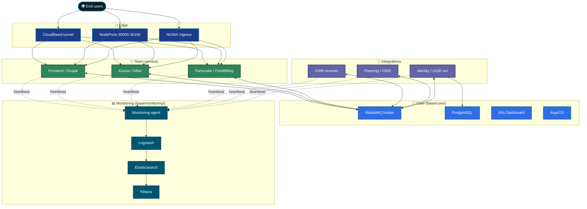

<!-- =================================================================== -->
<!--  ShiftFestival · Team Infra · README                                -->
<!--  Banner generated via kyechan99/capsule-render                      -->
<!-- =================================================================== -->

<p align="center">
  
</p>

<p align="center">
  <a href="#"></a>
  <a href="#"></a>
  <a href="#"></a>
  <a href="#"></a>
  <a href="#"></a>
  <a href="#"></a>
  <a href="#"></a>
</p>

<p align="center">
  <a href="../../actions/workflows/ci.yml"></a>
  <a href="https://argocd.desiderius.me"></a>
  <a href="SECURITY.md"></a>
  <a href="DOCUMENTATION.md"></a>
  <a href="#"></a>
</p>

<p align="center">
  
  
  
  
</p>

<p align="center">
  <em>Central infrastructure repository for the <strong>ShiftFestival</strong> integration project.</em><br/>
  <em>Kubernetes manifests, Kustomize layers, ArgoCD GitOps and operational runbooks — all in one place.</em>
</p>

---

## Table of Contents

1. [Why this repo exists](#why-this-repo-exists)
2. [Quick Start](#quick-start)
3. [Team Services Overview](#team-services-overview)
4. [Architecture at a Glance](#architecture-at-a-glance)
5. [Repository Layout](#repository-layout)
6. [CI/CD Pipeline](#cicd-pipeline)
7. [Deployment & Operations](#deployment--operations)
8. [NodePort Allocation](#nodeport-allocation)
9. [Conventions for Teams](#conventions-for-teams)
10. [Adding a New Service](#adding-a-new-service)
11. [Rollback & Recovery](#rollback--recovery)
12. [Documentation Rules](#documentation-rules)
13. [Maintainers & Support](#maintainers--support)

---

<p align="center">
  
</p>

## Why this repo exists

ShiftFestival is a multi-team integration project where six teams build independent applications that must talk to one another reliably. **Team Infra** owns the platform layer that makes this possible:

- A single Kubernetes cluster running every team's workload (Prod: `shift-festival`, Dev: `shift-festival-dev`).
- A central RabbitMQ broker for asynchronous, team-prefixed messaging.
- A shared observability stack (Elasticsearch + Kibana) for centralized logging and debugging.
- A **GitOps-driven** deployment model using **ArgoCD** — the repository is the single source of truth.

Everything in this repository is managed with **Kustomize**. If it does not render, it does not deploy.

---

## Quick Start

> **Prerequisite:** Ensure you have access to the cluster and the ArgoCD dashboard at [argocd.desiderius.me](https://argocd.desiderius.me).

```bash
# 1. Render prod manifests locally for validation
kubectl kustomize overlays/prod

# 2. Validate without applying
kubectl apply -k overlays/prod --dry-run=client

# 3. Lint YAML
find . -type f \( -name "*.yml" -o -name "*.yaml" \) -not -path "./.git/*" -print0 | xargs -0 yamllint

# 4. Lint shell scripts
shellcheck scripts/*.sh

# 5. Deploy (GitOps workflow)
# Simply push your changes to 'main' (for prod) or 'dev' (for dev).
# ArgoCD will detect the change and sync automatically.
git add . && git commit -m "feat: your change" && git push origin main

# 6. Verify via ArgoCD UI or kubectl
kubectl get pods -n shift-festival
```

For an emergency manual sync or to refresh secrets, use **GitHub Actions → "Deploy Infra to Kubernetes"**.

---

## Team Services Overview

| Team | Technology | NodePort Range | Base Folder | Heartbeat |
|------|-----------|---------------|----------------|-----------|
| **Facturatie** | FossBilling + MariaDB + Nginx | `30010–30019` | `base/team-facturatie/` | Yes |
| **Frontend** | Drupal + MariaDB + Nginx | `30020–30029` | `base/team-frontend/` | Yes |
| **Kassa** | Odoo + PostgreSQL + Nginx | `30030–30039` | `base/team-kassa/` | Yes |
| **CRM** | Salesforce receiver | `30040–30049` | `base/integrations/crm.yaml` | Yes |
| **Planning** | Office 365 integration | `30050–30059` | `base/integrations/planning.yaml` | Yes |
| **Monitoring** | ELK (Elasticsearch + Kibana) | `30060–30069` | `base/monitoring/` | — |
| **Identity** | UUID service | `30070–30100` | `base/integrations/identity-service.yaml` | Yes |
| **ArgoCD** | GitOps Controller | — (Own namespace) | `argocd/` | — |

> Heartbeat services report liveness over RabbitMQ to the monitoring agent. Do not remove them from team deployments.

---

## Architecture at a Glance


```mermaid
flowchart TB
    classDef external fill:#0b1f2a,color:#fff,stroke:#0a7ea4,stroke-width:2px;
    classDef edge     fill:#1e3a8a,color:#fff,stroke:#0a7ea4,stroke-width:2px;
    classDef core     fill:#326CE5,color:#fff,stroke:#0a7ea4,stroke-width:2px;
    classDef team     fill:#2f855a,color:#fff,stroke:#1a5738,stroke-width:2px;
    classDef integ    fill:#6264a7,color:#fff,stroke:#4a4880,stroke-width:2px;
    classDef monitor  fill:#005571,color:#fff,stroke:#004058,stroke-width:2px;

    USER([🌍 End users]):::external

    subgraph EDGE["🚪 Edge"]
        CF[Cloudflared tunnel]:::edge
        ING[NGINX Ingress]:::edge
        NP[NodePorts 30000-30100]:::edge
    end

    subgraph CORE["🧠 Core (base/core/)"]
        RMQ[RabbitMQ broker]:::core
        PG[PostgreSQL]:::core
        DASH[K8s Dashboard]:::core
        ARGO[ArgoCD]:::core
    end

    subgraph TEAMS["👥 Team services"]
        FE[Frontend / Drupal]:::team
        KAS[Kassa / Odoo]:::team
        FAC[Facturatie / FossBilling]:::team
    end

    subgraph INTEG["🔌 Integrations"]
        CRM[CRM receiver]:::integ
        PLAN[Planning / O365]:::integ
        ID[Identity / UUID svc]:::integ
    end

    subgraph MON["📊 Monitoring (base/monitoring/)"]
        ES[Elasticsearch]:::monitor
        LS[Logstash]:::monitor
        KB[Kibana]:::monitor
        AG[Monitoring agent]:::monitor
    end

    USER --> CF & NP & ING
    CF & NP & ING --> FE & KAS & FAC

    FE  <--> RMQ
    KAS <--> RMQ
    FAC <--> RMQ
    CRM <--> RMQ
    PLAN <--> RMQ
    ID  <--> RMQ

    ID --> PG

    FE  -. heartbeat .-> AG
    KAS -. heartbeat .-> AG
    FAC -. heartbeat .-> AG
    CRM -. heartbeat .-> AG
    PLAN -. heartbeat .-> AG
    ID  -. heartbeat .-> AG

    AG --> LS --> ES --> KB
```

**Highlights**

- **GitOps First** — ArgoCD ensures the cluster state matches the `main` or `dev` branch.
- **Unified Namespacing** — Resources are layered into `shift-festival` or `shift-festival-dev` via Kustomize overlays.
- **Heartbeat Pattern** — Standardized liveness reporting over RabbitMQ for all integrated services.
- **Persistent Storage** — Mandatory `strategy: type: Recreate` for database workloads to handle RWO volumes.

---

## Repository Layout

```text
Infra/
├── kustomization.yaml          # root entry point
├── README.md                   # this file
├── DOCUMENTATION.md            # deep architectural reference
├── CLAUDE.md                   # agent-specific rules & workflows
│
├── base/                       # central shared manifests
│   ├── setup/                  # namespace, storage, central configmaps
│   ├── core/                   # rabbitmq, postgres, cloudflared
│   ├── team-frontend/          # drupal stack
│   ├── team-kassa/             # odoo stack
│   ├── team-facturatie/        # fossbilling stack
│   └── monitoring/             # elk stack + monitoring agent
│
├── overlays/                   # environment layers
│   ├── prod/                   # namespace: shift-festival
│   └── dev/                    # namespace: shift-festival-dev
│
├── argocd/                     # GitOps controller installation & apps
├── scripts/                    # operational helpers (secrets, notifications)
└── .github/workflows/          # ci.yml + emergency deploy.yml
```

---

<p align="center">
  
</p>

## CI/CD Pipeline


```mermaid
flowchart LR
    classDef trig    fill:#0b1f2a,color:#fff,stroke:#0a7ea4,stroke-width:2px;
    classDef ci      fill:#1e3a8a,color:#fff,stroke:#0a7ea4,stroke-width:2px;
    classDef gate    fill:#f59e0b,color:#0b1f2a,stroke:#b45309,stroke-width:2px;
    classDef deploy  fill:#EF7B4D,color:#fff,stroke:#b45309,stroke-width:2px;
    classDef notify  fill:#6264a7,color:#fff,stroke:#4a4880,stroke-width:2px;

    PUSH[Push / PR]:::trig --> CI

    subgraph CI["🧪 ci.yml"]
        direction TB
        K[Kustomize render]:::ci
        Y[yamllint]:::ci
        S[shellcheck]:::ci
        G[Gitleaks scan]:::ci
        T[Trivy config scan]:::ci
    end

    CI --> GATE{Branch == main?}:::gate

    GATE -->|yes| ARGOCD

    subgraph ARGOCD["🚀 GitOps (ArgoCD)"]
        direction TB
        SYNC[Detect Git change]:::deploy
        APPLY[Apply overlays/prod]:::deploy
        HEAL[Self-healing active]:::deploy
    end

    ARGOCD --> TEAMS[📣 Teams notification]:::notify
```

**CI on every push and PR**

1. Render the Kustomize tree for validation.
2. Lint all YAML and Bash scripts.
3. Scan for secrets (Gitleaks) and security misconfigurations (Trivy).

**Deploy — GitOps via ArgoCD**

1. ArgoCD polls the repository every ~3 minutes (or via webhook).
2. It detects the new commit on `main` and renders the `overlays/prod` layer.
3. It applies the changes to the cluster and monitors rollout health.
4. **Self-healing:** Any manual cluster changes are automatically reverted to match the Git state.

---

## Deployment & Operations

### GitOps Sync
ArgoCD handles deployment automatically. To monitor or force a sync:
- Visit [argocd.desiderius.me](https://argocd.desiderius.me).
- Or use the ArgoCD CLI: `argocd app sync shift-festival-prod`.

### Local Debugging
```bash
# Preview the final rendered YAML for prod
kubectl kustomize overlays/prod

# Verify pod status
kubectl get pods -n shift-festival

# Tail logs
kubectl logs -n shift-festival deployment/<name> -f
```

### Operational Rules
- **Git is the source of truth.** Never hand-edit resources in the cluster.
- **Secrets:** Use `./scripts/create-secret.sh setup/.env <namespace>` on the VM to bootstrap `shift-secrets`.
- **Database Safety:** Always use `strategy: type: Recreate` for workloads with persistent volumes.

---

## NodePort Allocation

| Range          | Owner               | Notes                                  |
|----------------|---------------------|----------------------------------------|
| `30000-30009`  | Team Infra          | Reserved for platform services         |
| `30010-30019`  | Team Facturatie     | FossBilling / Ingress                  |
| `30020-30029`  | Team Frontend       | Drupal stack                           |
| `30030-30039`  | Team Kassa          | Odoo stack                             |
| `30040-30049`  | Team CRM            | Salesforce receiver                    |
| `30050-30059`  | Team Planning       | Office 365 integration                 |
| `30060-30069`  | Team Monitoring     | Kibana / dashboards                    |
| `30070-30100`  | Identity + reserved | UUID service + future allocations      |

---

## Conventions for Teams

- **RabbitMQ:** Team-prefixed queues (e.g., `kassa.orders`) are mandatory.
- **Naming:** Follow the `<team>-<role>` pattern for Deployments and `<service>-<purpose>` for ConfigMaps.
- **Labels:** The `app` label must match the service name for proper routing.

---

## Rollback & Recovery

- **Git Revert:** The preferred method. Revert the bad commit on `main`, and ArgoCD will sync the previous stable state.
- **ArgoCD Rollback:** Use the UI or CLI for immediate rollback (disables auto-sync temporarily).
- **Manual Rollback Script:** `scripts/runtime-rollback.sh` is deprecated and kept for reference only.

---

## Documentation Rules

Keep it in sync! Every major change requires an update to:
1. `README.md` (High-level architecture & tables).
2. `DOCUMENTATION.md` (Detailed component reference).
3. `CLAUDE.md` (Agent guardrails and workflows).

---

<p align="center">
  
</p>

## Maintainers & Support

| Channel                         | Use it for                                |
|---------------------------------|-------------------------------------------|
| GitHub Issues                   | Feature requests & infrastructure bugs    |
| Microsoft Teams — Team Infra    | Urgent platform incidents                 |
| `DOCUMENTATION.md`              | Deep architectural dive                   |

<p align="center">
  
</p>

<p align="center">
  <sub><strong>IntegrationProject-Groep1</strong> · ShiftFestival 2026 · Team Infra · Erasmushogeschool Brussel</sub>
</p>
